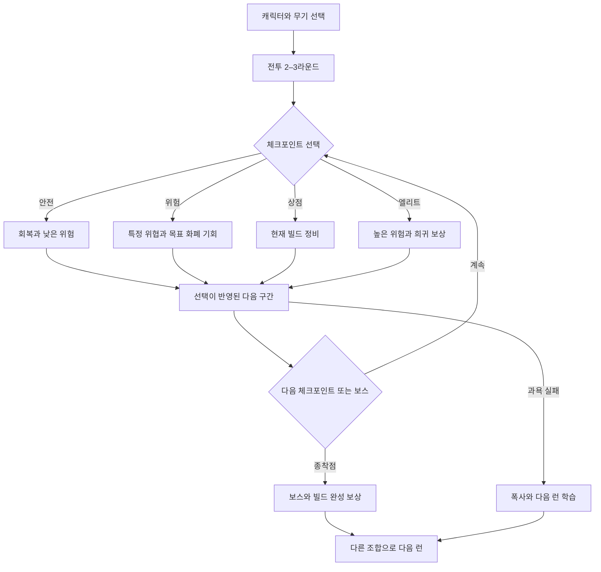
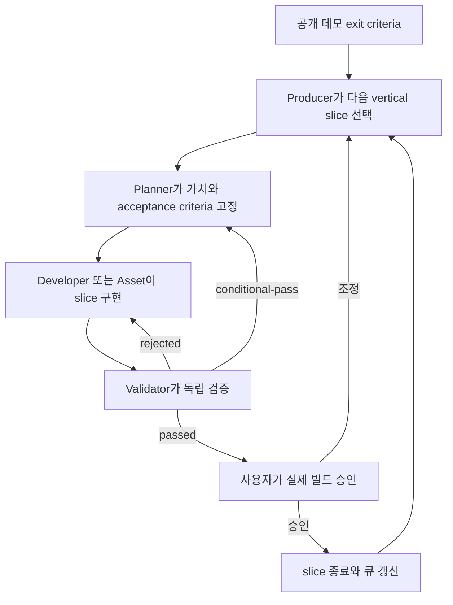
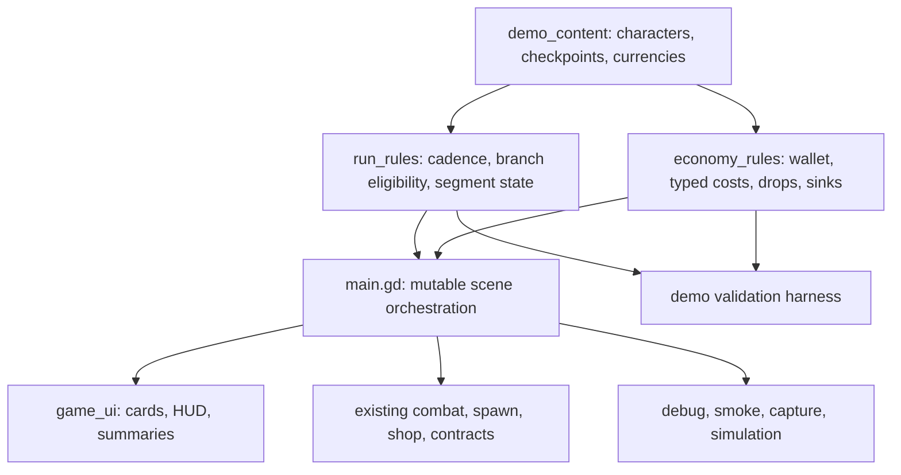
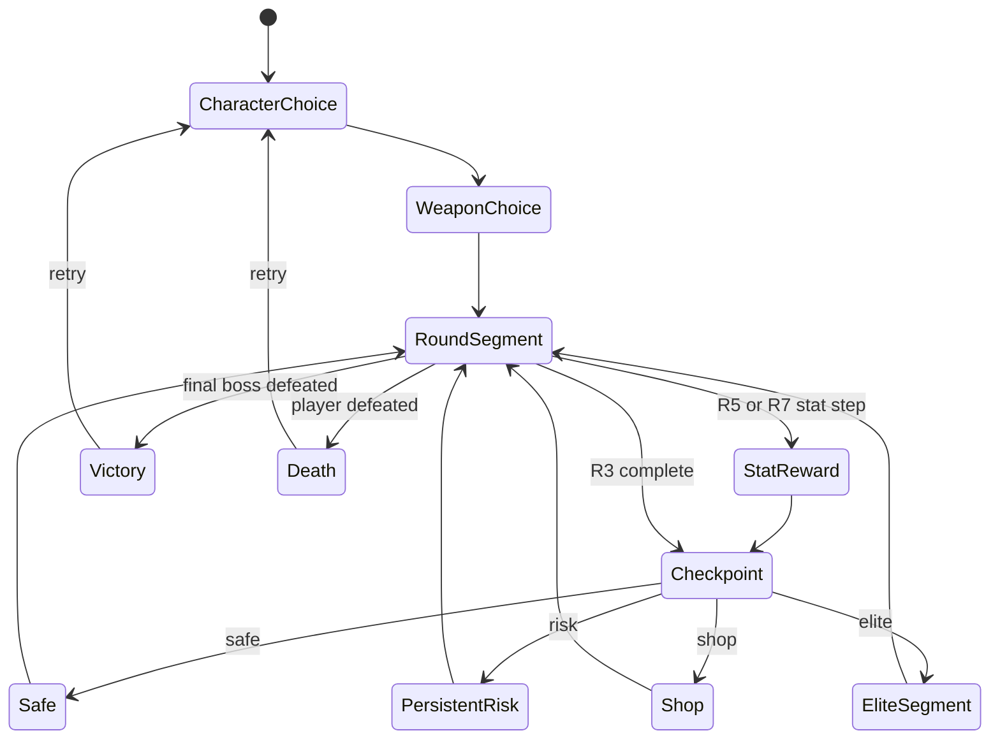
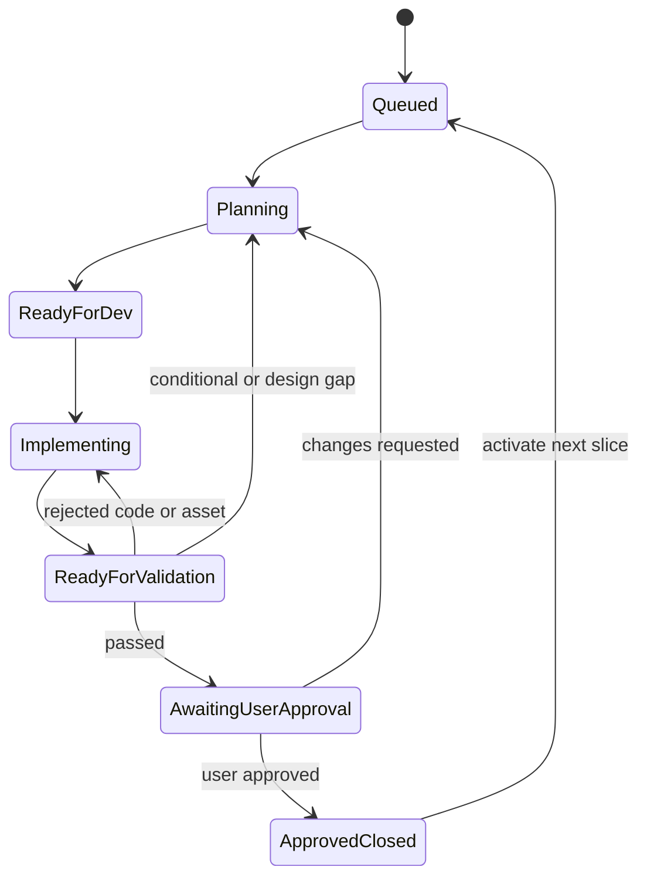

# Bro-exile Public Demo Vertical Slice Development Pipeline - Plan

## Goal Capsule

- **Objective:** Brotato류 플레이어가 20–30분 동안 위험과 보상을 직접 조절하며 깊은 빌드 제작을 경험하고, 종료 후 다음 런을 원하게 만드는 공개 데모를 완성한다.
- **Product authority:** 이 문서의 Product Contract가 공개 데모 범위와 출시 판단의 기준이다. 기존 todo와 운영 문서는 구현 근거이자 재배열 대상이다.
- **Authority order:** Product Contract, Planning Contract의 KTD, dependency-ordered U-ID, 저장소 운영 규칙 순으로 판단한다.
- **Execution profile:** 한 번에 하나의 playable slice만 진행하고 독립 Validator 판정과 사용자 승인을 통과한 뒤 다음 slice를 연다.
- **Stop conditions:** 제품 범위를 바꿔야 하거나, 사용자 승인이 없거나, active slice projection이 canonical todo와 다르거나, 기존 미커밋 변경을 안전하게 보존할 수 없으면 멈춘다.
- **Tail ownership:** Producer가 queue와 handoff를 관리하고 Product Owner가 playable slice와 itch.io 공개 배포를 최종 승인한다.
- **Open blockers:** planning을 시작하기 전에 해결해야 할 제품 결정은 없다.

---

## Product Contract

### Summary

현재 라운드 전투를 기반으로 2–3라운드마다 안전, 위험, 상점, 엘리트 중 다음 구간의 성격을 선택하는 공개 데모를 만든다.
개발은 기존 todo 순서가 아니라, 실제 플레이 가능한 vertical slice를 독립 검증과 사용자 승인까지 닫는 방식으로 진행한다.

### Problem Frame

현재 M1은 D1–D8의 전투, 상점, 계약, 10라운드 위협, 무기 정체성을 검증했지만 D9의 Producer 결정 이후 Planner plan이 생성되지 않아 handoff가 멈춰 있다.
큐는 기능 의존성을 잘 기록하지만, D9–D11을 순서대로 끝내는 것만으로는 공개 데모의 핵심 약속인 자발적 위험 선택과 반복 욕구를 일찍 검증하기 어렵다.

현재 빌드는 플레이어가 더 큰 보상을 위해 난이도를 능동적으로 올려야 할 동기가 약하다.
공개 데모는 캐주얼한 조작과 깊은 빌드 제작을 결합하고, 플레이어가 욕심 때문에 위험을 키웠다가 폭사할 수 있는 선택 구조를 증명해야 한다.

### Key Decisions

- **공개 데모 우선:** 첫 출시 목표는 얼리 액세스나 캠페인이 아니라 외부 플레이어가 바로 실행할 수 있는 작은 공개 데모다.
- **캐주얼한 Path of Exile:** 핵심 플레이어는 Brotato류 전투를 좋아하면서 더 깊은 빌드 제작을 원하는 사람이다.
- **플레이어 주도 난이도:** 난이도는 자동 조절보다 런 중 위험 선택으로 높아지고, 더 큰 위험은 현재 런의 더 많은 빌드 보상으로 이어진다.
- **발견 중심 경제:** 특정 적과 화폐의 관계를 도감이나 영구 로그로 설명하지 않고 플레이어의 실험과 기억에 맡긴다.
- **체크포인트 흐름:** 완전 분기 지도 대신 2–3라운드마다 다음 구간의 성격을 선택해 현재 10라운드 구조를 확장한다.
- **Vertical slice 운영:** 기존 D9–D11을 버리지 않고 공개 데모 가치에 따라 재배열하며, 한 번에 하나의 플레이 가능한 단위만 진행한다.
- **사용자 승인 경계:** 역할 handoff마다 묻지 않고, Producer가 독립 검증을 마친 플레이 가능한 단위를 사용자에게 전달한다.

### Actors

- A1. **핵심 플레이어:** 캐주얼한 arena-survivor 전투 위에 더 깊은 빌드 조합과 위험 선택을 원하는 사람이다.
- A2. **사용자/Product Owner:** 플레이 가능한 vertical slice를 직접 확인하고 계속 진행, 조정, 중단을 결정한다.
- A3. **Producer:** 공개 데모 목표에서 다음 vertical slice를 고르고 Planner, Developer, Asset, Validator를 라우팅한다.
- A4. **Planner:** slice의 플레이어 가치, 범위, acceptance criteria, 중단 조건을 구현 가능한 plan으로 정리한다.
- A5. **Developer/Asset:** 승인된 범위의 코드 또는 후보 에셋을 만들고 검증 가능한 handoff를 남긴다.
- A6. **Validator:** 구현 주체와 독립적으로 실제 플레이, 자동 검증, 렌더 증거를 확인하고 판정한다.

### Requirements

**Demo promise**

- R1. 공개 데모는 Brotato류 플레이어가 캐주얼한 조작으로 Path of Exile식 빌드 제작의 깊이를 맛보게 해야 한다.
- R2. 데모의 기본 단위는 메타 해금 없이 완결되는 20–30분 한 런이어야 한다.
- R3. 한 런의 성공과 실패 모두 다른 캐릭터, 무기, 위험, 화폐 조합으로 다음 런을 시도할 이유를 남겨야 한다.
- R4. 과욕으로 감당할 수 없는 위험을 선택해 폭사하는 결과는 유효한 학습과 재미로 취급해야 한다.

**Run choice rhythm**

- R5. 플레이어는 2–3라운드마다 안전, 위험, 상점, 엘리트 중 다음 구간의 성격을 선택해야 한다.
- R6. 각 체크포인트 선택은 다음 전투의 위험, 회복 기회, 상점 접근, 보상 가능성 중 하나 이상을 바꿔야 한다.
- R7. 위험 선택은 특정 적이나 위협의 출현을 늘리고 감당한 위험에 비례한 현재 런 보상을 제공해야 한다.
- R8. 안전 선택은 진행을 막지 않지만 위험 선택보다 목표 화폐와 고가치 빌드 기회가 적어야 한다.
- R9. 보스와 보스 보상은 한 런의 빌드가 완성됐는지 검증하는 종착점이어야 한다.



**Build economy and discovery**

- R10. 공개 데모의 첫 경제는 상점 리롤, 빌드 부품 획득, 장비 강화에 대응하는 약 3개의 목적별 화폐를 가져야 한다.
- R11. 각 화폐는 서로 다른 획득 방법이나 적 유형과 연결되어 플레이어가 원하는 성장 방향에 맞춰 위험을 고르게 해야 한다.
- R12. 계약과 체크포인트는 추가되는 위험을 보여주되 어떤 적이 어떤 화폐를 주는지 직접 설명하지 않아야 한다.
- R13. 화폐와 적의 관계는 플레이 중 실제 드롭과 소비 결과를 통해 발견할 수 있어야 한다.
- R14. 화폐 종류는 선택을 깊게 만들어야 하며 단순한 관리 부담이나 동일 보상의 색상 차이로 끝나서는 안 된다.

**Delivery pipeline**

- R15. Producer는 기존 D9–D11과 관련 backlog를 공개 데모 가치에 대응하는 vertical slice로 재매핑해야 한다.
- R16. 각 vertical slice는 하나의 플레이어 가치를 실제 게임에서 처음부터 끝까지 확인할 수 있는 범위여야 한다.
- R17. 한 slice는 Planner, Developer 또는 Asset, Validator, 사용자 승인까지 닫힌 뒤에만 다음 slice로 넘어가야 한다.
- R18. 사용자는 플레이 가능한 승인 단위와 제품 결정을 막는 질문에만 개입해야 한다.
- R19. 모든 역할은 관련 todo의 Work Log 또는 report에 상태, 변경 산출물, 검증, 질문, 다음 owner lane을 남겨야 한다.
- R20. 큐 대시보드와 현재 상태판은 실제 산출물과 owner lane을 반영해야 하며 존재하지 않는 plan이나 끝난 handoff를 active로 가리키면 안 된다.



**Validation and release**

- R21. Developer 또는 Asset은 자신의 결과를 최종 통과 처리할 수 없고 Validator가 독립 판정해야 한다.
- R22. 각 slice는 관련 headless, debug, smoke, 실제 플레이, 렌더 capture 중 필요한 증거를 남겨야 한다.
- R23. UI와 에셋 변경은 headless 성공만으로 통과하지 않고 실제 Godot capture와 pixel-perfect gate를 충족해야 한다.
- R24. 숙련도별 자동 시뮬레이션은 난이도 회귀를 찾는 계기판이어야 하며 인간 플레이테스트를 대체하면 안 된다.
- R25. 공개 데모는 완주 가능성, 치명적 회귀 부재, 선택과 텍스트의 가독성을 충족한 뒤 외부 플레이테스트로 넘어가야 한다.

### Key Flows

- F1. 위험을 선택해 빌드를 가속하는 런
  - **Trigger:** 플레이어가 체크포인트에 도달한다.
  - **Actors:** A1
  - **Steps:** 플레이어가 다음 구간의 성격을 고르고, 선택한 위협을 상대하며, 관련 화폐와 빌드 기회를 발견하고, 상점 또는 강화에서 소비한다.
  - **Outcome:** 플레이어는 현재 빌드로 더 큰 위험을 감당할지 판단하며 보스 또는 폭사로 런을 마친다.
  - **Covered by:** R3–R14
- F2. 플레이 가능한 vertical slice 승인
  - **Trigger:** Producer가 공개 데모 exit criteria에서 다음으로 가장 큰 불확실성을 고른다.
  - **Actors:** A2–A6
  - **Steps:** Planner가 범위를 고정하고, Developer 또는 Asset이 구현하며, Validator가 독립 검증하고, 사용자가 실제 빌드를 플레이한다.
  - **Outcome:** slice가 승인되어 큐가 갱신되거나 같은 slice가 명확한 수정 범위로 되돌아간다.
  - **Covered by:** R15–R25

### Acceptance Examples

- AE1. 안전 경로를 고른 경우
  - **Covers R5, R6, R8.**
  - **Given:** 플레이어의 현재 빌드가 불안정하다.
  - **When:** 체크포인트에서 안전 또는 회복 방향을 고른다.
  - **Then:** 런을 이어갈 가능성은 높아지지만 목표 화폐와 고가치 보상 기회는 위험 경로보다 적다.
- AE2. 목표 화폐를 노리고 위험을 높인 경우
  - **Covers R7, R11–R13.**
  - **Given:** 플레이어가 이전 런에서 특정 적의 드롭과 화폐 사용처를 경험했다.
  - **When:** 그 적이나 관련 위협이 늘어나는 선택을 고른다.
  - **Then:** 계약은 정확한 화폐 공식을 설명하지 않지만 실제 전투와 드롭은 플레이어의 가설을 시험할 수 있게 한다.
- AE3. 과욕으로 폭사한 경우
  - **Covers R3, R4, R7.**
  - **Given:** 플레이어가 보상 욕심으로 위험을 누적했다.
  - **When:** 현재 빌드가 감당하지 못하는 적 조합에서 사망한다.
  - **Then:** 실패 원인과 선택한 위험을 복기할 수 있고 다른 조합을 시험할 이유가 남는다.
- AE4. 구현은 동작하지만 시각 검증이 실패한 경우
  - **Covers R21–R23.**
  - **Given:** headless와 smoke 검증은 통과했다.
  - **When:** 실제 capture에서 텍스트 겹침이나 64px 가독성 실패가 발견된다.
  - **Then:** Validator는 slice를 통과시키지 않고 수정 범위와 증거를 handoff에 남긴다.
- AE5. 사용자 승인을 기다리는 경우
  - **Covers R17–R20.**
  - **Given:** Validator가 slice를 통과시켰다.
  - **When:** Producer가 실제 빌드와 핵심 판단 질문을 사용자에게 전달한다.
  - **Then:** 사용자가 승인하거나 조정을 요청할 때까지 다음 slice를 시작하지 않는다.

### Success Criteria

- 외부 플레이어가 한 런을 마친 뒤 다른 조합으로 다음 런을 시도하고 싶다고 반응한다.
- 플레이어가 안전과 위험을 자기 빌드 상태에 따라 선택하고, 더 큰 위험이 더 나은 현재 런 보상으로 이어졌다고 느낀다.
- 여러 런을 통해 특정 적, 화폐, 강화 목적의 관계를 스스로 추론할 수 있다.
- 체크포인트 선택이 휴식, 상점, 엘리트, 위험 계약을 서로 다른 종류의 판단으로 느끼게 한다.
- 각 vertical slice는 실제 플레이와 독립 검증 증거를 갖고 닫히며 active handoff가 산출물보다 앞서거나 뒤처지지 않는다.
- 공개 데모 후보는 인간 플레이테스트, 자동 회귀 검증, 실제 렌더 검증을 모두 통과한다.

### Scope Boundaries

**Deferred for later**

- Slay the Spire식 완전 분기 지도와 대규모 노드 콘텐츠.
- 여러 런을 잇는 영구 성장, 해금, 캠페인, 진행 저장.
- 3화폐 검증을 넘어서는 대규모 제작, 변환 재료, 장기 거래 경제.
- 최종 캐릭터 직업명, 개별 외형, 대량의 신규 아이템과 유물.
- 반복 운영이 안정되기 전의 자동 queue watcher와 무인 배포.

**Outside this product's identity**

- 플레이어 선택 없이 뒤에서 난이도를 자동으로 올리거나 내리는 구조.
- 복잡한 조작 숙련을 빌드 제작보다 우선하는 전투 설계.
- 위험과 관계없이 동일한 보상을 지급해 안전 선택이 항상 정답이 되는 경제.

### Dependencies / Assumptions

- 기존 D7의 10라운드, 누적 계약, 상점 rarity, 중간·최종 보스, 사망 복기 루프를 공개 데모의 검증된 출발점으로 사용한다.
- D9의 제품 범위 결정은 완료됐지만 현재 상태판이 지목한 Planner plan은 존재하지 않으므로 첫 slice에서 handoff를 정상화해야 한다.
- D11의 3화폐 후보는 유효한 입력이지만 공개 데모의 위험 선택과 연결되도록 다시 계획해야 한다.
- 현재 agent pipeline과 D9 관련 미커밋 변경은 사용자 작업이므로 planning과 구현에서 보존하고 충돌을 확인해야 한다.
- 핵심 플레이어와 반복 욕구 가설은 현재 외부 사용자 조사보다 Product Owner의 장르 경험과 제품 방향에 근거한다.

### Outstanding Questions

**Deferred to Implementation**

- 화폐와 체크포인트 카드의 최종 한국어 이름, 아이콘, 문구는 실제 capture 가독성과 사용자 승인에 맞춰 조정한다.
- 10라운드 후반부 시간과 드롭 빈도는 대표 플레이에서 active-run 20–30분과 세 화폐의 유효 소비가 함께 성립하도록 조정한다.

### Sources / Research

- `todos/README.md`: M1 완료·pending 상태와 현재 추천 큐.
- `docs/operations/agent-pipeline-current-state.md`: D9의 확정 범위, owner lane, 누락된 Planner handoff.
- `docs/operations/2026-06-05-agent-team-operating-model.md`: Producer, Planner, Developer, Asset, Validator 역할과 durable handoff 계약.
- `todos/017-complete-p1-m1-d7-ten-round-threat-economy.md`: 10라운드, 계약, rarity, 보스, 사망 복기 검증 근거.
- `todos/020-pending-p2-m1-d11-multi-currency-economy.md`: 3화폐 후보와 위험 보상 연결 방향.
- `todos/021-pending-p1-m1-d9-character-archetype-matrix.md`: 캐릭터·무기·아키타입에 관한 확정 제품 결정.
- `todos/022-pending-p1-m1-d10-skill-simulation-validation.md`: 자동 시뮬레이션의 역할과 한계.
- `docs/quality/2026-06-30-pixel-perfect-quality-gates.md`: UI, 에셋, capture의 시각 품질 기준.

---

## Planning Contract

Product Contract changed: no R/A/F/AE IDs changed; planning-owned questions were resolved and the remaining items were narrowed to implementation-time tuning.

### Key Technical Decisions

- KTD1. **Extract pure rules without rewriting combat.** `scripts/main.gd` remains the mutable scene orchestrator while new `RefCounted` rule modules own checkpoint cadence, typed economy, and demo content. Combat update, drawing, enemy dictionaries, and scene ownership stay in place.
- KTD2. **Replace fixed contract/shop branches at three checkpoints.** R3, R5, and R7 each open one checkpoint after any scheduled stat reward. The selected branch replaces the old fixed contract and shop tail for that checkpoint.
- KTD3. **Give recovery one owner.** Safe fully heals once and advances. Risk applies one persistent contract, shop opens one existing shop without healing, and elite reserves a segment-scoped elite threat with a kill-earned bonus.
- KTD4. **Keep checkpoint effects explicit and immutable per segment.** A choice records its target segment and cannot be reopened or changed. Persistent risk survives later safe choices while elite reservations expire after their segment.
- KTD5. **Use a typed three-wallet economy.** Reroll, build-part acquisition, and weapon-upgrade balances have typed costs and unique sinks. No fallback payment, negative balance, cross-run carry, or drop without an active sink is allowed.
- KTD6. **Hide formulas, not feedback.** Player UI shows qualitative risk, segment scope, pickup identity, balances, and prices. Enemy-to-currency mappings and exact drop rates remain absent from player-facing cards but visible to debug and report surfaces.
- KTD7. **Prove the risk/economy loop before expanding characters.** Checkpoint and three-currency slices precede D9 character selection and soft bias. D9 then reuses the stable content and economy metadata while keeping every character compatible with every starter weapon.
- KTD8. **Keep ten rounds and measure active-run wall clock.** Timing begins when character selection is confirmed and ends at death or victory. Explicit pause time is excluded, while combat and choice time are reported separately; late-round durations are tuned only after measurement.
- KTD9. **Separate pure-rule tests from scene integration evidence.** A dedicated Godot harness tests deterministic checkpoint and economy fixtures. Main-scene CLI scenarios prove UI handlers, combat integration, smoke progression, capture, and terminal summaries.
- KTD10. **Make smoke routes scripted and fail-fast.** Smoke scenarios choose checkpoint options by stable identity rather than array position. Missing options, missing handlers, disabled-only states, or unchanged progress state fail with a non-zero result and a state dump instead of timing out silently.
- KTD11. **Treat slice todos as canonical records.** Individual todo frontmatter and latest Work Log own lifecycle, owner lane, artifacts, Validator verdict, and user gate. `todos/README.md` and the current-state document are projections repaired before new dispatch when they drift.
- KTD12. **Keep lifecycle, verdict, and approval as separate axes.** Validator `passed` enters `awaiting-user-approval`; it does not complete a slice. `conditional-pass` and `rejected` return to the same slice, while only an explicit user decision can approve and close it.
- KTD13. **Ship a Windows itch.io package first.** The plan includes a Windows export preset, packaged-build launch verification, public download copy, and human approval before upload. Steam integration and macOS release validation remain deferred.

### High-Level Technical Design

The new rules form a thin deterministic layer around the existing scene rather than a second game runtime.



The run event router owns branch composition so the old fixed reward chain cannot execute after a checkpoint branch.



The agent pipeline is a resumable state machine with one human-only approval edge.



### Output Structure

```text
scripts/
  game/
    run_rules.gd
    economy_rules.gd
    demo_content.gd
  tools/
    demo_validation_harness.gd
    validate_agent_pipeline.py
    test_validate_agent_pipeline.py
scenes/
  tools/
    demo_validation_harness.tscn
todos/
  023-ready-p1-demo-checkpoint-risk-loop.md
  024-pending-p1-demo-windows-release.md
docs/
  reports/
    playtests/
      public-demo-first-cohort.md
    validation/
      public-demo-skill-profile-baseline.md
export_presets.cfg
```

### Sequencing and Approval Gates

1. Rebaseline the queue and prove the current P7/P8 baseline before gameplay changes.
2. Introduce deterministic rule seams and close the checkpoint risk slice.
3. Add the typed wallet, drops, sinks, UI, and terminal reporting as one player-visible currency slice.
4. Add D9 character selection and soft bias on the stable economy surface.
5. Add D10 skill profiles and use them to tune the full loop without replacing human playtests.
6. Harden captures, package the Windows build, run the first external cohort, and request final upload approval.

Every player-visible slice ends at `awaiting-user-approval`. The next slice remains queued until the approved decision is written to the canonical todo and both projections are updated.

### System-Wide Impact

- **Runtime state:** Run reset, reward routing, healing, spawn profiles, pickups, shop costs, HUD, terminal reports, and smoke selection all gain checkpoint or currency state.
- **UI:** The existing option-card surface expands to checkpoint metadata and a three-balance HUD while preserving the current font and pixel fallback path.
- **Validation:** Pure rule fixtures become separate from main-scene integration scenarios, but P7/P8 regression commands remain mandatory characterization gates.
- **Operations:** Todo state becomes machine-checkable, while Product Owner approvals and public upload stay human-only.
- **Assets:** Currency and checkpoint visuals remain candidate assets until 64px preview, Godot capture, and user promotion approval pass.
- **Distribution:** The repository gains its first export preset and packaged Windows artifact contract.

### Risks and Mitigations

| Risk | Impact | Mitigation |
| --- | --- | --- |
| `scripts/main.gd` grows past a safe review surface | Merge conflicts and hidden state regressions | Move only deterministic rules to `scripts/game/`; leave combat and rendering unchanged in this plan. |
| Fixed reward steps execute after a checkpoint branch | Duplicate shops, contracts, healing, or stuck overlays | Make the checkpoint router the sole owner of branch follow-up events and cover R3/R5/R7 combinations in the harness. |
| Three currencies become cosmetic or unusable | More UI burden without deeper choices | Require one typed sink per currency and fail validation for sinkless drops, fallback payment, or negative balances. |
| Discovery becomes unreadable randomness | Players cannot form hypotheses for the next run | Keep formulas hidden but make pickups, balances, costs, segment danger, and terminal flows observable. |
| New mandatory choices deadlock smoke | Automated gates time out without diagnosis | Use scripted identities, bounded shop budgets, progress watchdogs, and non-zero failures with state dumps. |
| Current ten rounds remain too short | The build promise does not fit a 20–30 minute run | Record combat, choice, and pause time separately before tuning late-round duration. |
| Queue projections drift from todo truth | Agents resume the wrong slice or skip approval | Validate one active slice, existing artifacts, readiness, owner lane, latest handoff, and user gate before dispatch. |
| Windows export passes locally but fails for players | Public demo cannot launch | Verify a packaged artifact on a clean Windows environment before itch.io upload approval. |
| Existing uncommitted pipeline changes are overwritten | User work is lost | Treat the dirty worktree as a stop condition, inspect overlapping diffs, and merge forward without reverting unrelated edits. |

### Alternatives Considered

- **Finish D9–D11 in their current numeric order:** rejected because it postpones the public demo's risk-and-currency proof and preserves the handoff stall.
- **Refactor the full game loop before new features:** rejected because combat and rendering already work and a broad rewrite would delay playable evidence.
- **Keep one ore currency:** rejected because it cannot create target-farming motives or distinct reroll, acquisition, and upgrade decisions.
- **Build a full branching map:** deferred because checkpoint branches deliver the selected rhythm with less new content and UI surface.
- **Target Steam first:** deferred because itch.io provides a smaller external feedback loop before store integration.

### Documentation and Operational Notes

- Each handoff writes the canonical todo first, then updates `todos/README.md` and `docs/operations/agent-pipeline-current-state.md` as projections.
- `passed` is a Validator verdict, `awaiting-user-approval` is a user gate, and `complete` is the todo lifecycle result after approval.
- Public upload requires Product Owner approval even when all automated and Validator gates pass.
- New UI and asset work must cite actual preview, metadata, and capture paths in the handoff.
- If a slice produces a durable debugging or workflow lesson, capture it after the slice lands rather than during execution.

---

## Implementation Units

### U1. Rebaseline the Vertical-Slice Queue and State Contract

**Goal:** Replace the stale D9 active dispatch with a canonical one-slice queue that can be resumed without chat context.

**Requirements:** R15–R21, F2, AE5, KTD11–KTD13.

**Dependencies:** None.

**Files:**

- Modify `todos/README.md`.
- Modify `docs/operations/agent-pipeline-current-state.md`.
- Modify `docs/operations/agent-pipeline-quickstart.md`.
- Modify `.codex/skills/bro-exile-agent-pipeline/references/role-prompts.md`.
- Modify `todos/011-pending-p2-shop-and-reward-choice-pass.md`.
- Modify `todos/018-pending-p2-upgrade-item-relic-review.md`.
- Modify `todos/020-pending-p2-m1-d11-multi-currency-economy.md`.
- Modify `todos/021-pending-p1-m1-d9-character-archetype-matrix.md`.
- Modify `todos/022-pending-p1-m1-d10-skill-simulation-validation.md`.
- Create `todos/023-ready-p1-demo-checkpoint-risk-loop.md`.
- Create `todos/024-pending-p1-demo-windows-release.md`.
- Create `scripts/tools/validate_agent_pipeline.py`.
- Create `scripts/tools/test_validate_agent_pipeline.py`.

**Approach:** Define slice todo frontmatter and Work Log as canonical state. Keep lifecycle, owner lane, Validator verdict, and user gate separate; update queue and active-dispatch projections only after a valid handoff. Reorder the public demo path to checkpoint, currency, character, simulation, and release while preserving earlier todo history and existing dirty changes.

**Execution note:** Begin with fixture-based consistency failures for the current missing-plan drift and double-active-slice case before updating operational documents.

**Patterns to follow:** `docs/operations/2026-06-05-agent-team-operating-model.md` handoff shape, `todos/README.md` status vocabulary, and the existing progressive frontmatter fields in `todos/021-pending-p1-m1-d9-character-archetype-matrix.md`.

**Test scenarios:**

1. A valid queue with one active slice resolves its owner, latest handoff, artifacts, and next allowed transition.
2. A queue with two active slices fails consistency validation.
3. A projection that references a missing plan or wrong readiness fails before dispatch.
4. A `passed` slice without user approval blocks activation of the next slice.
5. `rejected` routes code or asset defects to Developer/Asset while a design gap routes to Planner.
6. An approved Work Log allows the current slice to close and the next queued slice to become active.

**Verification:** A fresh Producer session can recover the active slice, owner, evidence, approval state, and next permitted transition from repository files alone. The consistency validator accepts the repaired projections and rejects the drift fixtures.

### U2. Establish Characterization Gates and Pure Rule Seams

**Goal:** Preserve P7/P8 behavior while creating deterministic boundaries for checkpoint, economy, and demo content rules.

**Requirements:** R16, R21–R24, F2, AE4, KTD1, KTD8–KTD10.

**Dependencies:** U1.

**Files:**

- Create `scripts/game/run_rules.gd`.
- Create `scripts/game/economy_rules.gd`.
- Create `scripts/game/demo_content.gd`.
- Create `scripts/tools/demo_validation_harness.gd`.
- Create `scenes/tools/demo_validation_harness.tscn`.
- Modify `scripts/main.gd`.

**Approach:** Add pure `RefCounted` rule objects and fixtures without moving combat, rendering, or mutable node state. Route existing round/reward/contract/economy queries through compatibility methods so current behavior stays unchanged before feature branches are enabled.

**Execution note:** Add characterization coverage before changing reward, recovery, drop, or smoke behavior.

**Patterns to follow:** `scripts/ui/ore_ui_theme.gd` for stateless helpers, `scripts/main.gd` debug exit-code conventions, and `scenes/tools/player_asset_harness.tscn` for a dedicated harness scene.

**Test scenarios:**

1. Existing P7 reward routes, contract multipliers, shop rarity, and boss patterns match the pre-extraction baseline.
2. Existing P8 weapon selection, three starter attacks, shop decoration, and weapon-specific smoke paths remain valid.
3. Run reset clears all new rule state while preserving current start, death, victory, and retry behavior.
4. The harness can evaluate checkpoint and economy fixtures without instantiating combat or UI nodes.
5. Missing fixture content or an unknown rule identifier fails with a non-zero result and a useful state dump.

**Verification:** Existing P7/P8 debug, smoke, and capture evidence remains unchanged, and the new harness runs deterministic fixtures independently of the main scene.

### U3. Deliver the Checkpoint Risk Slice

**Goal:** Replace fixed contract/shop tails at R3, R5, and R7 with one meaningful safe, risk, shop, or elite route choice.

**Requirements:** R3–R9, R16–R23, F1, F2, AE1, AE3–AE5, KTD2–KTD4, KTD8–KTD10.

**Dependencies:** U2.

**Files:**

- Modify `scripts/game/run_rules.gd`.
- Modify `scripts/game/demo_content.gd`.
- Modify `scripts/main.gd`.
- Modify `scripts/ui/game_ui.gd`.
- Modify `scripts/tools/demo_validation_harness.gd`.
- Modify `todos/023-ready-p1-demo-checkpoint-risk-loop.md`.

**Approach:** Convert the reward chain into an event router that invokes one checkpoint after R3/R5/R7 and accepts exactly one branch result. Preserve scheduled stat rewards before R5/R7 checkpoints, remove unconditional recovery from common round and shop transitions, and make safe the only full-heal branch. Risk reuses persistent contracts; elite applies a segment-scoped spawn profile and kill-earned bonus.

**Patterns to follow:** `_reward_chain_for_round()`, `_open_next_reward_or_round()`, `_open_contract_choice()`, `GameUI.show_choice()`, and the P7 capture-after-draw pattern.

**Test scenarios:**

1. Covers AE1. R3, R5, and R7 each open one checkpoint after the correct preceding reward and never before the round ends.
2. Choosing each branch does not also execute the old fixed contract or shop tail.
3. Safe fully heals once; risk, shop, and elite preserve current HP and all four reach the next segment.
4. Persistent risk remains active after later safe choices while an elite reservation expires after its target segment.
5. A shop branch always exposes a free exit even when every purchase and reroll is unaffordable.
6. A checkpoint cannot reopen or change after selection, including pause/resume and overlay re-entry.
7. Scripted smoke completes safe, risk, shop, and elite routes; missing or disabled targets fail immediately rather than timing out.
8. Covers AE4. Four checkpoint cards remain readable at the target viewport with visible segment scope, qualitative danger, and outcome type.

**Verification:** The checkpoint harness, all four route smoke scenarios, P7/P8 regressions, manual branch play, and an actual checkpoint UI capture pass. Validator records `passed` and the slice waits for Product Owner approval before U4 begins.

### U4. Add Typed Currency Sources and Run Accounting

**Goal:** Replace the single ore balance with three typed wallets and observable enemy-linked acquisition without changing player-facing discovery rules.

**Requirements:** R7, R10–R14, R16–R24, F1, AE2–AE4, KTD5, KTD6, KTD9, KTD10.

**Dependencies:** U3 and its user approval gate.

**Files:**

- Modify `scripts/game/economy_rules.gd`.
- Modify `scripts/game/demo_content.gd`.
- Modify `scripts/main.gd`.
- Modify `scripts/ui/game_ui.gd`.
- Modify `scripts/tools/demo_validation_harness.gd`.
- Modify `todos/020-pending-p2-m1-d11-multi-currency-economy.md`.

**Approach:** Introduce typed balances, acquisition counters, spend counters, enemy drop profiles, and risk or elite modifiers. Each enemy family has one primary currency source; formulas remain data-driven and debug-visible while the player observes only pickup identity and wallet changes. Disable any currency source whose sink is not active for the current slice.

**Patterns to follow:** `_make_enemy()` drop metadata, `_drop_pickups()`, `_update_pickups()`, `_contract_ore_multiplier()`, `_update_hud()`, and `_run_report_lines()`.

**Test scenarios:**

1. Each currency starts at zero, resets on retry, and never carries into another run.
2. Representative enemy families drop their configured primary currency and risk or elite choices increase the intended opportunity.
3. Exact drop mappings are visible in debug output but absent from checkpoint cards and player-facing formula text.
4. A currency with no active sink cannot enter a drop or reward pool.
5. Pickup collection, leftover cleanup, death, and victory preserve accurate acquired, spent, and held totals per currency.
6. Negative balances, cross-currency fallback payment, and untyped pickup identifiers fail validation.
7. Currency pickups and balances remain distinguishable in combat and HUD captures without relying on text alone.

**Verification:** Deterministic drop fixtures and main-scene debug scenarios prove all sources and reset paths. Combat and HUD captures show three readable resources, and the existing one-ore regressions are replaced only after typed parity is established.

### U5. Connect Three Currency Sinks to Build Decisions

**Goal:** Make reroll, build-part acquisition, and weapon upgrade compete through distinct currencies and produce a complete risk-to-reward-to-build loop.

**Requirements:** R3, R7–R14, R16–R25, F1, F2, AE2–AE5, KTD5–KTD7, KTD9–KTD12.

**Dependencies:** U4.

**Files:**

- Modify `scripts/game/economy_rules.gd`.
- Modify `scripts/game/demo_content.gd`.
- Modify `scripts/main.gd`.
- Modify `scripts/ui/game_ui.gd`.
- Modify `scripts/tools/demo_validation_harness.gd`.
- Modify `todos/011-pending-p2-shop-and-reward-choice-pass.md`.
- Modify `todos/018-pending-p2-upgrade-item-relic-review.md`.
- Modify `todos/020-pending-p2-m1-d11-multi-currency-economy.md`.

**Approach:** Give each wallet exactly one first-class sink. Keep reroll on its own balance, price shop parts with the acquisition balance, and add an explicit weapon-upgrade choice paid by the upgrade balance. Shop exit remains free, terminal reports show per-wallet flow, and boss completion produces a terminal grade rather than an unusable fourth resource.

**Patterns to follow:** `_choice_option_disabled()`, `_choose_shop_option()`, `_apply_shop_purchase()`, weapon part decoration, shop rarity, and shared terminal report rendering.

**Test scenarios:**

1. For each sink, zero balance disables only that action while free exit remains enabled.
2. Exact-cost purchases reach zero, one-short purchases remain disabled, and excess balances deduct the typed cost only once.
3. Reroll, part purchase, and weapon upgrade each consume only their designated currency.
4. A failed purchase restores the original typed balance and leaves stock and upgrade state unchanged.
5. Covers AE2. A player can choose a risk, acquire its currency, spend it at the matching sink, and observe a stronger build in the same run.
6. Death and victory summaries show checkpoint history, persistent risk, last damage cause, per-wallet flow, purchases, weapon state, and boss result.
7. Retry clears balances, pending rewards, checkpoint history, risk reservations, active handlers, and summary accumulators before returning to character selection.
8. Player-facing UI never reveals exact enemy-to-currency probabilities.

**Verification:** Typed-cost fixtures, shop integration debug, a complete risk-to-sink smoke route, terminal summary capture, and representative manual play all pass. Validator confirms the slice is meaningfully different from one ore before Product Owner approval unlocks U6.

### U6. Add D9 Character Selection and Economy Bias

**Goal:** Add three build-language characters whose identities change desired shop and reward choices without locking starter weapons.

**Requirements:** R1–R3, R10–R19, R21–R25, F1, F2, AE4, AE5, KTD6, KTD7, KTD9–KTD12.

**Dependencies:** U5 and its user approval gate.

**Files:**

- Modify `scripts/game/demo_content.gd`.
- Modify `scripts/game/economy_rules.gd`.
- Modify `scripts/main.gd`.
- Modify `scripts/ui/game_ui.gd`.
- Modify `scripts/tools/demo_validation_harness.gd`.
- Modify `todos/021-pending-p1-m1-d9-character-archetype-matrix.md`.

**Approach:** Insert character selection before weapon selection using the approved compression, chain, and conversion code names. Keep all three weapons available to every character, add no character stat bonuses or production character art, and use metadata plus soft shop or reward bias to express favored archetypes while retaining neutral bridge choices.

**Patterns to follow:** `_start_run()`, `_open_weapon_select()`, `_starter_weapon_options()`, P8 weapon debug routes, weapon-specific shop decoration, and the D9 Product Owner decisions already recorded in the todo.

**Test scenarios:**

1. A new run and retry both follow character selection, weapon selection, then R1.
2. Every character can equip every starter weapon and reach R1 without stat bonuses or hard locks.
3. Character metadata exposes the approved archetype tags and soft bias to debug output.
4. Soft bias changes candidate weighting but preserves neutral bridge choices and does not guarantee one build.
5. The existing shop, checkpoint, currency, death, and victory flows retain the selected character context.
6. Scripted routes cover every character and weapon combination without choice deadlock.
7. Covers AE4. Character cards show code name, build language, representative tags, and cost or weakness without text overlap.

**Verification:** Character-metadata fixtures, all character-weapon smoke routes, P8 regressions, shop-bias debug output, manual same-weapon comparison, and actual character selection capture pass before user approval.

### U7. Add D10 Skill Profiles and Balance Regression

**Goal:** Compare the completed checkpoint, currency, and character loop across reproducible player-skill profiles without treating simulation as the fun verdict.

**Requirements:** R3, R7–R14, R21–R25, F1, AE3, KTD8–KTD10.

**Dependencies:** U6 and its user approval gate.

**Files:**

- Modify `scripts/game/run_rules.gd`.
- Modify `scripts/game/economy_rules.gd`.
- Modify `scripts/main.gd`.
- Modify `scripts/tools/demo_validation_harness.gd`.
- Modify `todos/022-pending-p1-m1-d10-skill-simulation-validation.md`.
- Create `docs/reports/validation/public-demo-skill-profile-baseline.md`.

**Approach:** Reuse smoke movement and choice primitives behind random, rough, and skilled policies with reproducible seeds. Each policy owns movement, risk appetite, checkpoint route, spending priorities, and bounded shop behavior. Aggregate round reached, terminal result, active-run time, deaths, kills, currency flow, route history, and build outcomes without using the result as a substitute for human fun judgment.

**Patterns to follow:** `_start_smoke_playtest()`, `_choose_smoke_option()`, the D10 profile definitions, existing non-zero smoke exits, and run report counters.

**Test scenarios:**

1. The same seed and profile reproduce the same route choices and summary-level outcome.
2. Random, rough, and skilled profiles use distinct risk appetites and spending policies.
3. Each profile handles unaffordable shops, missing preferred choices, death, victory, and retry without deadlock.
4. A stalled state or missing route target fails immediately with the decision context in the output.
5. Multiple seeds aggregate results without leaking state between runs.
6. Active-run time excludes explicit pause and reports combat and choice time separately.
7. Profile results detect large balance regressions but do not automatically approve a slice.

**Verification:** Multi-seed profile output is reproducible and documented, all earlier route and currency smoke gates remain green, and Validator compares the automated trend with representative human runs.

### U8. Harden and Package the Windows itch.io Demo

**Goal:** Produce a readable, stable Windows package and external-playtest evidence suitable for Product Owner-approved itch.io upload.

**Requirements:** R1–R4, R9, R16–R25, F1, F2, AE3–AE5, KTD8, KTD9, KTD11–KTD13.

**Dependencies:** U7 and its Validator pass.

**Files:**

- Modify `scripts/main.gd`.
- Modify `scripts/ui/game_ui.gd`.
- Modify `scripts/tools/demo_validation_harness.gd`.
- Modify `README.md`.
- Modify `docs/README.md`.
- Modify `todos/024-pending-p1-demo-windows-release.md`.
- Create `export_presets.cfg`.
- Create `docs/reports/playtests/public-demo-first-cohort.md`.

**Approach:** Freeze feature scope, run full regression and pixel-perfect capture gates, configure a Windows release export, and validate the packaged artifact on a clean Windows environment. Run a small first-time-player cohort and record completion, death, checkpoint understanding, currency hypotheses, build choices, active-run time, immediate replay behavior, and critical friction. If capture evidence reveals a new asset defect, route it back through the candidate, preview, harness, capture, and promotion workflow instead of expanding the default release diff.

**Execution note:** Treat packaged-runtime and capture verification as the first proof for release-specific work; do not rely on editor-only success.

**Patterns to follow:** Existing capture-after-draw functions, `docs/quality/2026-06-30-pixel-perfect-quality-gates.md`, asset candidate promotion, and durable playtest reports.

**Test scenarios:**

1. A fresh packaged run starts at character selection and reaches death or victory without editor-only resources.
2. Retry from both terminal states resets all run state and begins a new character selection.
3. All checkpoint cards, three balances, typed prices, character cards, and terminal summaries remain readable in actual captures.
4. Existing P7/P8 regressions and all public-demo debug, smoke, harness, and simulation gates pass from the release candidate.
5. The Windows package launches on a clean target environment and preserves input, fonts, assets, audio, and save-free behavior.
6. At least five first-time external players complete or terminate one representative run, and the report records whether they voluntarily start or ask to start another.
7. A crash, progression deadlock, unreadable required text, missing sink, projection drift, or failed Windows launch rejects the release candidate.
8. Product Owner approval is recorded before any public itch.io upload.

**Verification:** Validator produces a release report containing command outcomes, capture paths, Windows package evidence, open non-blocking polish, and the external cohort summary. Product Owner explicitly approves or rejects public upload.

---

## Verification Contract

| Gate | Applies to | Evidence | Pass signal |
| --- | --- | --- | --- |
| Agent pipeline consistency | U1 and every handoff | `python3 scripts/tools/test_validate_agent_pipeline.py` and `python3 scripts/tools/validate_agent_pipeline.py` | One active slice, valid artifacts/readiness, matching projections, and a valid owner/verdict/user-gate transition. |
| Godot project load | U2–U8 | `godot --headless --path . --quit` | Project loads without parse, import, or scene errors. |
| Pure demo rules | U2–U8 | `godot --headless --path . res://scenes/tools/demo_validation_harness.tscn` | Deterministic run, economy, content, reset, and invalid-fixture scenarios pass. |
| P7/P8 characterization | U2–U8 | Existing P7 reward, contract, shop, boss, P8 weapon debug, smoke, and capture routes | Pre-existing round, threat, shop, boss, weapon, and UI contracts remain valid unless the plan explicitly replaces them. |
| Checkpoint route integration | U3–U8 | Public-demo checkpoint debug plus scripted safe, risk, shop, and elite smoke routes | R3/R5/R7 open once, selected paths advance, no fixed-tail duplication occurs, and no route stalls. |
| Typed currency integration | U4–U8 | Currency source, sink, reset, report, and risk-to-spend debug scenarios | Three wallets remain typed, non-negative, spendable at unique sinks, and absent when sinkless. |
| Character matrix | U6–U8 | Character metadata debug and all character-weapon smoke combinations | Every combination reaches R1 and preserves soft bias without hard locks. |
| Skill simulation | U7–U8 | Multi-seed random, rough, and skilled profile report | Same seed/profile is reproducible and large regressions are visible without auto-approving fun. |
| Visual QA | Every UI or asset-bearing unit | Actual Godot captures, 64px previews and metadata where assets change | Required text and silhouettes are visible, non-overlapping, and readable at the target size. |
| Run duration and replay | U7–U8 | Active-run timing plus first-time-player report | Representative runs land in 20–30 minutes and the report records immediate replay behavior. |
| Windows package | U8 | Release export plus clean Windows launch record | Packaged build starts, plays, terminates, and retries without editor-only dependencies. |

Validator hard rejects on crash or load failure, progression deadlock, missing route, sinkless currency, negative balance, unreadable required UI, stale queue projection, or failed packaged launch. `conditional-pass` is limited to non-blocking polish and cannot advance to user approval.

---

## Definition of Done

### Global Completion

- The artifact remains aligned with every Product Contract requirement, flow, acceptance example, success criterion, and scope boundary.
- The queue has one canonical active slice at a time and every closed slice contains durable implementation, verification, and user-approval evidence.
- All required automated, manual, pixel-perfect, and packaged-runtime gates in the Verification Contract pass.
- The public-demo candidate completes a 20–30 minute ten-round run with no critical progression or readability defect.
- The first external cohort report records whether players want another run and identifies any release-blocking confusion or failure.
- A clean Windows package is ready for itch.io, and Product Owner approval is recorded before upload.
- No abandoned experiment, unused compatibility path, stale debug branch, temporary asset promotion, or dead-end code remains in the final diff.
- Existing user changes are preserved and unrelated dirty-worktree edits are neither reverted nor silently absorbed.

### Per-Unit Completion

| Unit | Done when |
| --- | --- |
| U1 | Canonical todo state, projections, transition validator, and approval lock agree, with current D9 drift repaired. |
| U2 | Pure rule seams exist, the dedicated harness passes, and all pre-feature P7/P8 characterization evidence remains valid. |
| U3 | All checkpoint branches complete without duplicate rewards or deadlock, visual capture passes, and user approval is recorded. |
| U4 | Three typed sources, wallets, reset paths, debug visibility, and player-facing discovery feedback pass. |
| U5 | Each wallet has a unique useful sink and a complete risk-to-spend-to-build loop passes smoke, report, and user approval. |
| U6 | Three characters work with all starter weapons, soft bias is observable, UI is readable, and user approval is recorded. |
| U7 | Three reproducible skill profiles produce a durable baseline without replacing human playtest judgment. |
| U8 | Full regression, visual QA, Windows package launch, external cohort, release report, and upload approval pass. |

### Deferred Follow-Up Work

- Steam store and SDK integration.
- macOS and additional platform release validation.
- Full branching map and larger node-content catalog.
- Meta progression, unlocks, campaign, and save-state migration.
- Large-scale crafting, conversion materials, and trade economy.
- Full `scripts/main.gd` combat/render decomposition.
- Automated queue watcher, role spawning, retries, and unattended deployment.
