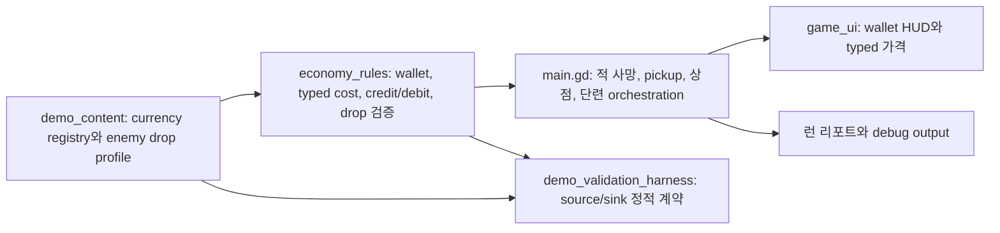

# Bro-exile 다중 화폐 playable slice 구현 계획

## Goal Capsule

- **목표:** 단일 광석 경제를 `광석`, `촉매`, `강화핵`의 typed wallet으로 바꾸고, 한 런 안에서 위험 선택부터 목표 화폐 획득, 대응 소비, 전투 강화까지 닫힌 경험을 만든다.
- **플레이어 약속:** 어떤 적과 위험을 상대할지에 따라 이번 런의 성장 경로가 달라지고, 관계를 직접 발견한 플레이어는 다음 런에서 원하는 화폐를 노릴 수 있다.
- **제품 권위:** 공개 데모 상위 계획의 R7, R10–R14와 KTD5–KTD7을 그대로 따른다. 기존 단일 범용 광석으로 되돌리는 선택은 이 slice에서 다시 열지 않는다.
- **전달 단위:** source/accounting과 세 sink는 내부 단계로 나누어 구현하되 런타임에서는 동시에 활성화한다. source만 있고 sink가 없는 플레이어 빌드는 만들지 않는다.
- **중단 조건:** 세 화폐 중 하나라도 소비처가 없거나, 결제 fallback/음수 잔액/런 간 이월이 생기거나, 1280×720 capture에서 세 잔액과 가격을 구분할 수 없으면 Validator handoff로 넘기지 않는다.
- **범위 밖:** 변환 화폐, 제작 조합, 메타 성장, 신규 캐릭터, 아이템·유물 전면 재설계, 10라운드 종료 뒤 소비 화면은 보류한다.

## 결정된 화폐 계약

| 내부 ID | 표시명 | 주 획득처 | 유일한 첫 소비처 | 역할 |
| --- | --- | --- | --- | --- |
| `ore` | 광석 | 일반 좀비·거미·방패 좀비, 라운드 클리어 | 상점의 `part`와 `item` 구매 | 안전 경로에서도 빌드를 이어 가는 기본 획득 화폐 |
| `catalyst` | 촉매 | 빠른 좀비·투척 좀비·독 거미·자폭 광부 | 상점 재고 리롤 | 위험한 기동·원거리·장판 적을 노릴 이유를 만드는 탐색 화폐 |
| `forge_core` | 강화핵 | `elite_zombie`, 체크포인트 엘리트, 중간 보스 | 장착 무기 단련 | 엘리트와 보스 위험을 수직 성장으로 바꾸는 희귀 화폐 |

이 이름은 첫 구현용으로 고정한다. capture에서 글자 폭이나 식별성이 실패하면 표시명만 조정할 수 있지만 내부 ID와 역할은 유지한다.

### 획득 규칙

1. 모든 일반 enemy family는 `scripts/game/demo_content.gd`에서 정확히 하나의 `primary_currency_id`와 기본 drop profile을 가진다.
2. 계약은 새 화폐를 직접 지급하지 않는다. 계약이 강화한 enemy family의 기존 primary drop 기회만 높여, 플레이어가 적과 화폐의 관계를 실제 드롭으로 발견하게 한다.
3. 일반 `elite: true` 승급은 해당 family의 primary currency를 증폭한다. 모든 엘리트를 강화핵으로 바꾸지 않는다.
4. `elite_zombie`와 체크포인트 엘리트는 강화핵 source다. 체크포인트 엘리트는 일반 drop과 별도로 한 번의 typed objective bonus를 받을 수 있다.
5. 중간 보스는 5라운드 종료 전에 소비 가능한 강화핵을 지급한다. 10라운드는 마지막 상점 뒤이므로 모든 spend currency drop을 비활성화하고 최종 보스는 기존 terminal 결과만 남긴다.
6. 라운드 클리어 보상은 광석에만 귀속한다. 촉매와 강화핵은 적·위험 source에서만 얻는다.
7. 라운드 종료 시 남은 typed pickup은 기존 광석과 같이 자동 회수한다. 사망 시 아직 줍지 않은 pickup은 획득 회계에 포함하지 않는다.

### 소비 규칙

1. 모든 유료 option은 `{ "currency_id": String, "amount": int }` 형태의 typed cost를 가진다. 무료 나가기는 amount 0이며 특정 화폐 잔액을 읽지 않는다.
2. `ore`는 현재 상점의 `part`와 생존 `item` 구매에만 사용한다.
3. `catalyst`는 리롤에만 사용한다. 리롤 가격 상승 수식은 `economy_rules.gd`가 소유한다.
4. `forge_core`는 스타터 선택으로 정해진 현재 무기의 고정 단련에만 사용한다. `_current_upgrade_target()`은 `selected_weapon_id`와 일치하는 weapon instance가 정확히 하나일 때만 대상을 반환하고, 없거나 여러 개면 단련을 비활성화하고 debug validation을 실패시킨다. 부품 수와 단련 단계를 분리하기 위해 그 instance에 `upgrade_rank`를 추가한다.
5. 첫 playable slice에서는 새 강화 선택 트리를 만들지 않는다. 상점의 `장비 단련` 카드가 현재 무기의 고정 mixed recipe를 즉시 적용하며, `upgrade_rank`는 0에서 시작해 III에서 멈추고 다음 가격은 `1 + upgrade_rank` 강화핵이다.
6. 초기 recipe는 곡괭이 `damage ×1.14, range ×1.04`, 네일건 `damage ×1.16, projectile speed ×1.04`, 랜턴 `damage ×1.12, range ×1.05`다. 네일건은 공격 속도와 사거리를 올리지 않아 최근 밸런스 방향을 보존한다.
7. 단련 카드의 표시명과 설명은 기존 무기별 decoration 패턴을 재사용한다. 강화핵이 부족하거나 III에 도달하면 이유와 다음 비용을 표시한 채 비활성화한다.
8. 결제 순서는 `cost 검증 → 효과 적용 가능성 확인 → 효과 적용 → spend commit`이다. 실패와 중복 입력은 wallet, stock, weapon, report ledger를 바꾸지 않는다.

## 플레이어 정보 계약

### 보여 주는 정보

- 전투 중 서로 다른 모양과 색을 가진 세 pickup, 획득 순간의 이름 또는 `+N` feedback.
- HUD의 세 잔액, 상점 카드의 typed 가격, 단련 결과와 현재 단련 단계.
- pause와 승리/패배 report의 화폐별 `획득 / 사용 / 보유`.
- 체크포인트의 위험 종류, 적용 구간, 정성적 보상 기대.

### 숨기는 정보

- 적 family별 정확한 drop table과 확률.
- 계약·엘리트 배율 수식.
- “이 적은 반드시 이 화폐를 준다”는 도감형 설명과 영구 발견 로그.

### 디버그에서만 보이는 정보

- `enemy_type`, `currency_id`, 기본 수량·확률, 위험/엘리트 modifier, 최종 drop 결과.
- 각 결제의 requested cost, before/after balance, commit 또는 rejection reason.
- 화폐별 `acquired - spent == held` 불변식과 reset state.

## 기술 설계



### 상태 모델

`scripts/main.gd`의 흩어진 `ore`, `run_ore_collected`, `run_ore_spent`를 세 번 복제하지 않는다. 다음처럼 registry가 허용한 ID만 다루는 하나의 run ledger를 둔다.

```gdscript
wallets = {
    "ore": {"balance": 0, "acquired": 0, "spent": 0},
    "catalyst": {"balance": 0, "acquired": 0, "spent": 0},
    "forge_core": {"balance": 0, "acquired": 0, "spent": 0},
}
```

- `EconomyRules.fresh_wallet(currency_ids)`가 reset shape를 만든다.
- `can_pay`, `credit`, `commit_spend`는 미등록 ID, 음수 amount, 부족 잔액을 거부하고 새 state 또는 명시적 결과를 반환한다.
- main scene은 모든 획득·소비·환불을 이 API로 통과시킨다.
- `round_currency_earned`도 ID별로 관리하되 플레이어 문구가 너무 길어지면 이번 라운드에 실제 증가한 화폐만 요약한다.

### 콘텐츠 모델

`scripts/game/demo_content.gd`에 다음 데이터를 둔다.

- currency registry: ID, 표시명, 짧은명, HUD 색, pickup 색·shape, sink ID.
- enemy currency profile: enemy type, primary currency, 기본 amount/chance.
- weapon upgrade recipes: weapon ID, 고정 mixed multiplier, cap, weapon-specific 표시 decoration.
- 활성 source/sink 목록. 활성 화폐는 source와 sink를 각각 하나 이상 가져야 한다.

초기 수치는 확정 밸런스가 아니라 검증 seed다.

- 광석: 기존 상점 가격대를 유지하되 라운드 고정 수입을 크게 낮춰 2라운드 첫 상점에서 일반 구매 1회 안팎을 목표로 한다.
- 대표 1–9라운드 런에서 라운드 클리어 고정 광석은 총 광석 획득의 40% 이하로 제한하고, 나머지는 적 primary drop에서 얻도록 한다.
- 촉매: normal run에서 리롤 1–3회, 해당 위험을 적극 선택하면 그보다 분명히 많은 기회를 목표로 한다.
- 강화핵: safe 중심 런은 중간 보스 이후 단련 1회, elite/risk를 노린 런은 2회 이상을 목표로 한다.
- 단련은 한 번에 기존 common part보다 강하지만 rare/legendary 부품의 고유 효과를 대체하지 않는다.

## 구현 단계

### Phase 1. Pure typed economy와 콘텐츠 registry

**수정 파일**

- `scripts/game/economy_rules.gd`
- `scripts/game/demo_content.gd`
- `scripts/tools/demo_validation_harness.gd`

**작업**

1. currency registry와 enemy primary drop profile을 추가한다.
2. fresh wallet, typed cost validation, credit, exact-cost spend, insufficient rejection, ledger invariant를 순수 함수로 만든다.
3. active currency마다 source와 sink가 존재하는지, enemy family마다 primary ID가 정확히 하나인지 검증한다.
4. 동일한 고정 enemy 구성에 safe와 risk profile을 적용해 `amount × chance × modifier` 기대 획득량을 계산하고, 대응 primary currency만 증가하는지 비교하는 결정론적 fixture를 추가한다.
5. 10라운드 drop disable과 final terminal-only 예외를 fixture로 고정한다.

**완료 신호**

- pure harness가 unknown ID, sinkless currency, negative amount, one-short payment를 명시적으로 실패시킨다.
- 아직 runtime 기능을 노출하지 않는다.

### Phase 2. Runtime wallet과 typed pickup 통합

**수정 파일**

- `scripts/main.gd`
- `scripts/game/run_rules.gd`

**작업**

1. 기존 ore state와 reset을 typed wallet/ledger로 마이그레이션한다.
2. `_make_enemy()`는 content profile을 참조하고 enemy dictionary에는 검증된 drop profile만 넣는다.
3. `_drop_pickups()`, `_update_pickups()`, leftover collection을 currency-aware `match`로 바꾼다. unknown pickup을 XP로 fallback하지 않는다.
4. `scripts/game/run_rules.gd`의 `contract_ore_multiplier()`를 currency ID를 받는 `contract_currency_multiplier()`로 일반화하고, 계약이 강화한 enemy family의 primary currency에만 배율을 적용한다.
5. 체크포인트 엘리트 고정 광석 보너스를 typed 강화핵 objective bonus로 바꾼다.
6. 10라운드에서는 spend currency pickup을 생성하지 않는다.

**완료 신호**

- 대표 적 세 family의 사망부터 pickup 수집까지 acquired와 held가 정확히 한 번 증가한다.
- retry에서 세 wallet과 모든 ledger가 0으로 돌아간다.

### Phase 3. 세 sink와 무기 단련 통합

**수정 파일**

- `scripts/main.gd`
- `scripts/game/economy_rules.gd`
- `scripts/game/demo_content.gd`

**작업**

1. shop catalog와 command option을 typed cost schema로 마이그레이션한다.
2. part/item은 광석, reroll은 촉매만 읽고 차감한다.
3. 모든 상점에 `장비 단련` 카드를 추가하고, 강화핵으로 현재 무기의 고정 recipe를 적용한다. 강화핵 부족과 III cap은 이유를 표시한 비활성 상태로 처리한다.
4. 기존 `weapon["level"] = 1 + mods.size()` 결합을 제거하고 부품 수와 `upgrade_rank`를 독립 표시한다.
5. 각 choice overlay에 증가하는 `choice_generation`을 부여하고 모든 option에 stable ID와 generation을 넣는다. handler는 현재 generation, 현재 stock 또는 단련 card membership, 미처리 상태를 먼저 검증한다. 성공 시 새 overlay를 열어 generation을 갱신하고, 효과 적용 실패 시 잔액과 상태를 바꾸지 않은 새 generation으로 같은 화면을 다시 표시한다.
6. smoke 자동 선택도 typed balance, stable option ID, 현재 `choice_generation`을 사용하게 바꾼다.

**완료 신호**

- exact-cost, one-short, 잘못된 화폐, 실패 rollback, 중복 선택이 모두 결정론적으로 검증된다.
- 화폐마다 `source → pickup → wallet → matching sink → 전투 효과` 경로가 한 번 이상 닫힌다.

### Phase 4. UI, report, discovery feedback

**수정 파일**

- `scripts/ui/game_ui.gd`
- `scripts/ui/ore_ui_theme.gd`
- `scripts/main.gd`

**작업**

1. 고정 `ore_label`을 동적 wallet pill 세 개로 바꾸고 main→UI contract를 `wallets`로 전환한다.
2. option meta와 shop title에서 typed 가격·잔액을 표시한다.
3. pickup은 색상 외 shape 차이를 갖게 하고 획득 feedback을 붙인다.
4. pause, victory, death, console report를 같은 per-wallet report source로 갱신한다.
5. checkpoint·계약 문구에서 정확한 source 공식은 숨기고 단일 광석 표현만 현재 화폐 문맥에 맞게 정리한다.

**완료 신호**

- 1280×720 HUD, 상점, 단련, 승리/패배 capture에서 세 화폐가 이름과 형태로 구분된다.
- debug output에는 공식이 보이지만 같은 내용이 checkpoint 카드에는 없다.

### Phase 5. Playable route와 독립 검증 handoff

**수정 파일**

- `scripts/tools/demo_validation_harness.gd`
- `scripts/main.gd`
- `todos/020-pending-p2-m1-d11-multi-currency-economy.md`
- 필요 시 `todos/011-pending-p2-shop-and-reward-choice-pass.md`
- 필요 시 `todos/018-pending-p2-upgrade-item-relic-review.md`

**작업**

1. `위험 선택 → 대응 적 처치 → 목표 화폐 수집 → 지정 sink 소비 → 전투 강화 → 다음 라운드` smoke route를 추가한다.
2. safe/elite/shop checkpoint 회귀와 기존 P7/P8/U3 debug를 다시 실행한다.
3. 대표 수동 런에서 safe 중심과 위험 중심의 소비 횟수·잔액·완주 난이도를 비교한다.
4. 같은 플레이어가 두 런을 연속 플레이한다. 첫 런 뒤 적·위험·화폐 관계에 대한 가설을 기록하고, 두 번째 런에서 공식 설명 없이 그 가설로 경로를 선택해 목표 화폐와 대응 sink 사용이 실제로 늘어나는지 확인한다. 가설이 생기지 않거나 목표 수입이 늘지 않으면 discovery feedback 또는 source mapping을 조정한 뒤 다시 검증한다.
5. Developer handoff에는 자동 결과와 실제 capture 경로를 남기고, Validator가 별도 실행으로 판정한다.

## Acceptance Criteria

- [x] 세 currency ID가 fresh run에서 0으로 시작하고 retry, death→retry, victory→retry에서 이월되지 않는다.
- [x] 모든 일반 enemy family는 정확히 하나의 유효한 primary currency ID를 가진다.
- [x] 동일한 고정 enemy 구성의 결정론적 기대값 fixture에서 관련 위험은 safe보다 대응 primary currency만 증가시키고 무관한 화폐를 늘리지 않는다.
- [x] sink 없는 화폐와 미등록 pickup ID는 생성·수집되지 않고 검증 실패가 된다.
- [x] typed pickup 수집과 leftover 자동 회수는 balance와 acquired를 각각 한 번만 증가시킨다. 사망 시 미수거 pickup은 획득으로 계산하지 않는다.
- [x] 리롤, part/item 구매, 장비 단련은 각각 촉매, 광석, 강화핵만 소비하고 다른 잔액으로 fallback하지 않는다.
- [x] exact-cost는 0이 되고 one-short는 비활성화되며, 실패·중복 입력은 wallet, stock, weapon, ledger를 바꾸지 않는다.
- [x] 이전 `choice_generation`의 stale option, 현재 stock에 없는 option, 이미 처리한 option은 효과 적용과 차감 전에 거부된다.
- [x] 부품 구매는 mod 목록을, 단련은 별도 `upgrade_rank`를 변경하고 HUD와 report에서 구분된다.
- [x] 단련 대상은 `selected_weapon_id`와 일치하는 weapon instance 하나로 고정되고, 대상이 없거나 중복이면 결제 전에 비활성화되어 validation이 실패한다.
- [x] 무기별 고정 단련 recipe는 rank마다 정확히 한 번 적용되고 III에서 비활성화되며, 네일건의 공격 속도와 사거리를 올리지 않는다.
- [x] 무료 상점 exit는 모든 잔액이 0이어도 활성화되어 진행 deadlock이 없다.
- [x] 모든 화폐에 대해 `acquired - spent == held`가 라운드 종료, 사망, 승리에서 성립한다.
- [x] 대표 1–9라운드 런에서 라운드 클리어 고정 광석 비중은 총 광석 획득의 40% 이하이며, 2라운드 첫 상점에서 일반 구매 1회 안팎은 가능하다.
- [x] 10라운드는 소비 불가능한 spend currency를 생성하지 않고 최종 보스 결과는 terminal report로 남는다.
- [x] 플레이어 UI에는 정확한 적→화폐 확률이 없지만 pickup, 잔액, 비용, 소비 결과는 즉시 구분된다.
- [ ] 같은 플레이어의 두 번째 런에서 첫 런의 적·위험·화폐 가설이 경로 선택으로 이어지고, 목표 화폐 획득과 대응 sink 사용이 첫 런보다 늘어난다.
- [x] source와 sink는 같은 runtime slice에서 활성화되고 source-only 또는 sink-only 공개 빌드는 존재하지 않는다.
- [x] 기존 safe/risk/shop/elite checkpoint, 스타터 무기 3종, 상점 rarity, 보스 진행, 5라운드 이후 진행 deadlock 회귀가 모두 통과한다.

## Verification Contract

### 자동 검증

```bash
mkdir -p /private/tmp/bro-exile-godot-home
env HOME=/private/tmp/bro-exile-godot-home /Users/highfence/Dev/.tools/bin/godot --headless --path /Users/highfence/Dev/Bro-exile --quit
env HOME=/private/tmp/bro-exile-godot-home /Users/highfence/Dev/.tools/bin/godot --headless --path /Users/highfence/Dev/Bro-exile res://scenes/tools/demo_validation_harness.tscn -- --rule=economy
env HOME=/private/tmp/bro-exile-godot-home /Users/highfence/Dev/.tools/bin/godot --headless --path /Users/highfence/Dev/Bro-exile -- --debug-demo-rule-seams
```

Developer는 sandbox에서 Godot의 `user://logs`가 쓰기 불가할 수 있으므로 위 임시 HOME을 사용한다. macOS system CA 경고가 출력되더라도 exit 0과 `DEMO_RULE_HARNESS_PASS` 또는 `failures=0` marker를 함께 확인한다. 구현 시 추가되는 currency debug/smoke flag와 기존 checkpoint 네 경로도 실행하며, 실패는 non-zero exit 또는 `failures > 0`으로 종료하고 state dump를 남겨야 한다.

### 시각 검증

- HUD wallet capture: 세 잔액의 폭, 아이콘/shape, HP·XP·공세·시간과의 충돌 확인.
- 상점 capture: 광석 가격, 촉매 리롤, 강화핵 단련 카드의 비용·비활성 사유, 무료 exit의 가독성 확인.
- 전투 capture: 세 pickup을 색상 없이도 구분할 수 있는지 확인.
- terminal capture: 승리와 패배 모두 per-wallet 획득/사용/보유와 단련 결과 확인.
- headless load 성공만으로 UI gate를 통과시키지 않는다.

### 수동 플레이 렌즈

- safe 중심 런에서도 첫 상점 이후 진행 가능한가?
- 위험 또는 elite를 고른 뒤 목표 화폐가 더 잘 모였다고 느끼는가?
- 플레이어가 설명 없이도 적과 화폐의 관계에 가설을 세울 수 있는가?
- 그 가설을 다음 런의 경로 선택에 사용해 목표 화폐와 대응 sink를 실제로 더 많이 쓰는가?
- 세 화폐 때문에 메뉴 관리가 늘었다기보다 성장 경로가 달라졌다고 느끼는가?
- 단련이 part 구매와 다른 수직 성장으로 체감되는가?
- 종료 후 다른 위험·화폐 경로로 한 번 더 해보고 싶은가?

## 주요 위험과 대응

| 위험 | 대응 |
| --- | --- |
| 라운드 보상이 적 drop 발견을 덮음 | 고정 보상은 광석에만 두고 크게 낮춘 뒤 적 source 비중을 report로 비교한다. |
| 화폐가 색만 다른 동일 pickup이 됨 | registry에 shape를 필수화하고 실제 combat capture에서 검증한다. |
| 결제 경로 일부가 전역 ore를 계속 읽음 | 모든 option을 typed cost로 이관하고 legacy `ore` 직접 접근을 `rg`로 0건 확인한다. |
| part가 `upgrade_rank`를 덮어씀 | mod count와 단련 rank를 별도 필드·표시로 분리한다. |
| 강화핵을 얻어도 상점 경로를 안 골라 못 씀 | 4·6·8·9라운드 일반 상점을 유지하고 단련 카드를 모든 상점에 둔다. |
| 10라운드에서 쓸 수 없는 화폐가 남음 | 마지막 전투의 spend currency drop을 비활성화하고 terminal result만 기록한다. |
| U4와 U5 사이에 sinkless 빌드가 생김 | 내부 구현만 단계적으로 하고 feature activation과 Validator handoff는 source/sink 동시 완료 뒤 수행한다. |
| 기존 사용자 미커밋 문서와 충돌 | `docs/README.md`와 D9 brainstorm은 수정하지 않고 현 상태를 보존한다. |

## Deferred Follow-ups

- 변환·제작·화폐 교환과 희귀 변형 재료.
- 특정 캐릭터의 화폐 soft bias와 D9 아키타입 연결.
- 발견 도감, 영구 로그, 메타 해금.
- 신규 아이템·유물 전면 재설계와 화폐 특화 계약 추가.
- power/tempo/shape 강화 선택 트리와 축별 강화 단계.
- 10라운드 전투 중 소비 또는 보스 사후 소비 화면.
- 장기 밸런스 수치는 D10 숙련도별 시뮬레이션과 인간 플레이 결과에서 조정한다.

## References

- `docs/plans/2026-07-12-001-feat-public-demo-vertical-slice-pipeline-plan.md`
- `todos/020-pending-p2-m1-d11-multi-currency-economy.md`
- `todos/011-pending-p2-shop-and-reward-choice-pass.md`
- `todos/018-pending-p2-upgrade-item-relic-review.md`
- `docs/brainstorms/2026-06-03-p7-threat-economy-and-p8-weapon-identity-brainstorm.md`
- `scripts/main.gd`
- `scripts/game/economy_rules.gd`
- `scripts/game/demo_content.gd`
- `scripts/game/run_rules.gd`
- `scripts/ui/game_ui.gd`
- `scripts/tools/demo_validation_harness.gd`
- `docs/solutions/ui-bugs/invisible-godot-ui-text-GodotPort-20260522.md`
