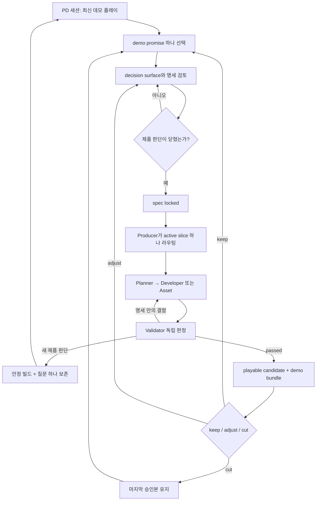
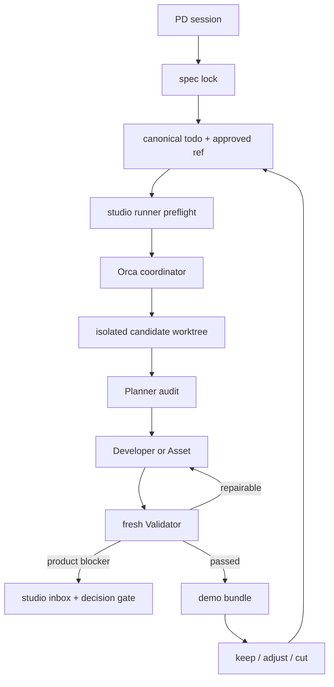
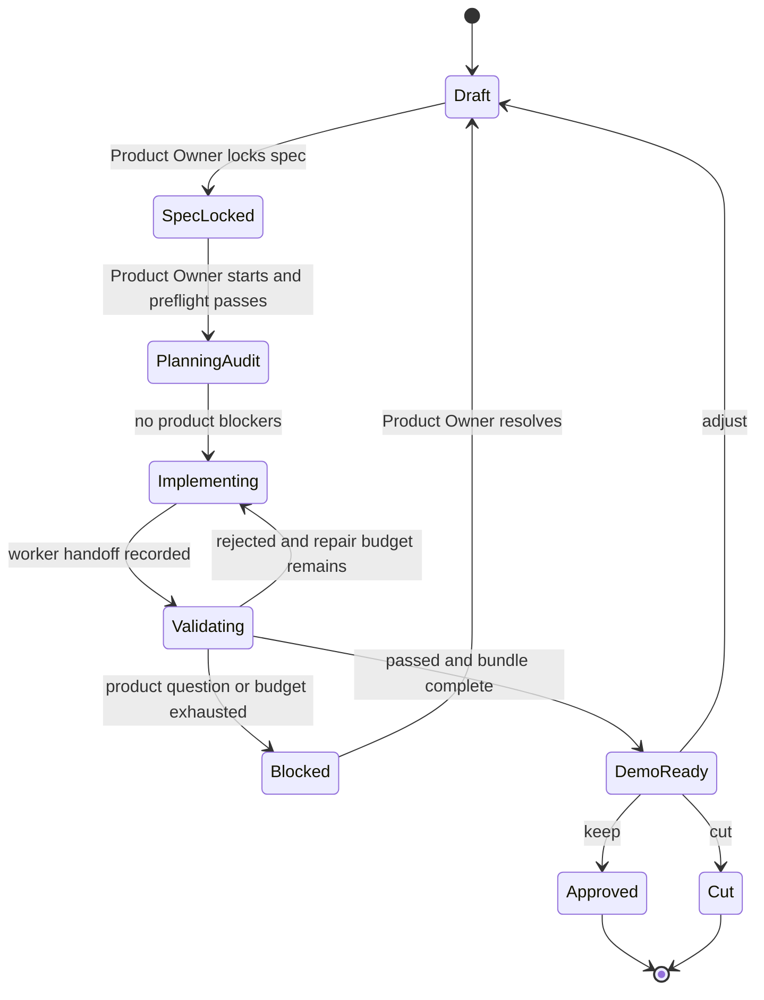

# Bro-exile 명세 잠금형 비동기 AI 제작 스튜디오 - Plan

## Goal Capsule

- **Objective:** 현업과 병행하는 Product Owner가 주 2–3회의 60–90분 PD 세션에 집중하고, 그 사이 에이전트 팀이 명세 안에서 다음 playable slice를 자율 완성하게 한다.
- **Product authority:** 이 문서는 비동기 제작 스튜디오의 운영 행동을 결정하고, `docs/plans/2026-07-12-001-feat-public-demo-vertical-slice-pipeline-plan.md`는 게임과 공개 데모의 제품 범위를 계속 결정한다.
- **Execution profile:** PD 세션에서 하나의 demo promise와 제품 결정 경계를 잠근 뒤 Producer, Planner, Developer 또는 Asset, Validator가 1–3일 동안 하나의 active slice만 진행한다.
- **Stop conditions:** 새 제품 판단, 명세 충돌, 반복 검증 실패, 안전한 변경 보존 불가, 승인되지 않은 에셋 promotion 또는 공개 배포가 필요하면 마지막 안정 빌드를 보존하고 멈춘다.
- **Tail ownership:** Producer가 역할 handoff, 안정 빌드, 사용자 inbox와 다음 PD 세션용 demo bundle을 책임진다.
- **Open blockers:** 없음. 실행 수명주기는 Orca, 제품·승인 상태는 저장소, 작업 격리는 local candidate worktree, 복구 한도는 검증 반려 2회로 정한다.

---

## Product Contract

### Summary

Bro-exile 개발을 명세 잠금형 비동기 AI 제작 스튜디오로 운영한다.
Product Owner는 최신 데모를 플레이하고 다음 경험을 결정하며, 에이전트 팀은 잠긴 명세 안에서 구현과 검증을 마쳐 다음 세션의 playable candidate를 준비한다.
구현은 저장소의 todo와 spec lock을 canonical state로 유지하고, Orca에는 격리된 candidate worktree와 역할 실행 수명주기만 맡긴다.

### Problem Frame

Product Owner는 현업과 게임 개발을 병행하므로 직접 코딩하거나 매일 긴 개발 세션을 유지하기 어렵다.
퇴근 후 확보할 수 있는 시간은 게임을 플레이하고 재미, 범위, 우선순위를 판단하는 데 가장 가치가 높다.

현재 저장소는 Producer, Planner, Developer, Asset, Validator 역할과 하나의 active slice, 독립 검증, Product Owner 승인 gate를 이미 사용한다.
그러나 기존 운영 모델은 반자동 dispatch를 전제로 하며 구현 중 디자인 질문이 나타나면 에이전트가 멈춘다.
질문을 비동기 구간으로 넘기면 제한된 PD 세션이 대기와 재설명에 소비되므로, 예측 가능한 제품 판단은 자율 실행 전에 명세에서 닫아야 한다.

자동 검증은 코드와 회귀를 빠르게 확인할 수 있지만 discovery 감정과 다음 런 의도를 판정하지 못한다.
사람의 역할은 줄이는 것이 아니라 플레이와 제품 판단으로 집중하고, 에이전트의 역할은 명세 안의 제작과 증거 수집으로 넓힌다.

### Key Decisions

- **명세 잠금형 자율성:** PD 세션에서 예상되는 제품 결정과 경계 사례를 검토한 뒤에만 자율 제작을 시작해 중간 정지를 줄인다.
- **하나의 demo promise:** 각 slice는 기능 묶음이 아니라 다음 플레이에서 증명할 경험 하나를 책임진다.
- **WIP 1:** 승인되지 않은 여러 slice를 병렬로 열지 않아 방향 오류와 통합 실패의 반경을 제한한다.
- **제품 판단과 구현 판단의 분리:** Product Owner는 플레이 경험, 범위, 우선순위를 결정하고 에이전트는 명세 안의 기술 선택을 맡는다.
- **제한적 후보 실험:** 명세가 허용한 되돌리기 쉬운 선택만 최대 두 후보로 만들고, 새 제품 방향이 필요한 선택은 사용자에게 돌려보낸다.
- **플레이 가능한 handoff:** 다음 PD 세션은 구현 로그가 아니라 즉시 실행 가능한 후보, 짧은 변화 요약과 플레이 렌즈에서 시작한다.
- **안정 빌드 우선:** 실패한 자율 실행은 마지막 playable build를 깨지 않으며, Product Owner 승인 전에는 다음 slice를 열지 않는다.

### Actors

- A1. **Product Owner:** 주 2–3회의 PD 세션에서 데모를 플레이하고 demo promise, 명세, keep/adjust/cut과 공개 승인을 결정한다.
- A2. **Producer:** 현재 제품 목표에서 active slice를 하나만 열고 역할 라우팅, 상태 일관성, 사용자 inbox와 demo bundle을 관리한다.
- A3. **Planner:** 플레이 피드백을 decision surface, acceptance example, 범위 경계와 잠글 수 있는 명세로 바꾼다.
- A4. **Developer:** 잠긴 명세 안에서 Godot 구현과 코드 결함 수정을 수행하고 검증 가능한 handoff를 남긴다.
- A5. **Asset:** 잠긴 명세 안에서 후보 에셋과 실제 게임 capture를 만들며 승인 전에는 runtime asset을 promotion하지 않는다.
- A6. **Validator:** 구현 주체와 독립적으로 자동 검증, 실제 렌더, 회귀와 handoff 증거를 판정하고 제품 감정은 Product Owner에게 남긴다.

### Requirements

**PD session and specification lock**

- R1. Product Owner는 주 2–3회, 회당 60–90분의 PD 세션으로 파이프라인을 운영할 수 있어야 한다.
- R2. PD 세션은 최신 playable candidate 또는 마지막 안정 빌드와 짧은 플레이 렌즈에서 시작해야 한다.
- R3. 각 PD 세션은 다음 자율 구간이 증명할 demo promise를 하나만 선택해야 한다.
- R4. Planner는 자율 제작 전에 예상되는 제품 결정, 경계 사례, 대안과 load-bearing assumption을 decision surface로 제시해야 한다.
- R5. 잠글 명세는 플레이어 결과, acceptance example, must/may/must-not, 허용된 기본값과 후보 실험, 중단 조건을 포함해야 한다.
- R6. 검토 후 버린 제품 대안은 새로운 플레이 증거가 생기기 전까지 다시 열지 않도록 명세에 남겨야 한다.
- R7. 예측 가능한 제품 판단이 해결되거나 기본값으로 위임된 뒤에만 slice를 `spec locked`로 전환해야 한다.

**Autonomous production window**

- R8. Producer는 항상 하나의 active slice만 유지해야 한다.
- R9. 에이전트 팀은 PD 세션 사이의 1–3일 동안 잠긴 명세의 계획, 구현, 수정과 검증을 자율 수행해야 한다.
- R10. 코드 결함, 테스트 실패와 명세 안의 구현 선택은 사용자 개입 없이 같은 slice에서 해결해야 한다.
- R11. 새 재미 방향, 범위 확장, 우선순위 변경 또는 명세 모순이 발견되면 자율 실행을 멈추고 Product Owner 판단을 요청해야 한다.
- R12. 되돌리기 쉬운 후보 실험은 명세가 허용한 경우에만 최대 두 개까지 만들 수 있어야 한다.
- R13. 에이전트는 현재 slice의 사용자 승인 없이 다음 demo promise나 slice를 활성화해서는 안 된다.
- R14. 자율 제작과 수정은 마지막 안정 빌드를 보존하고 실패한 후보를 Product Owner의 기본 실행 대상으로 바꾸지 않아야 한다.
- R15. Asset 작업은 후보 생성, normalization, preview, harness, capture, 사용자 승인, promotion 경계를 유지해야 한다.
- R16. Developer 또는 Asset 결과는 완료 후보가 되기 전에 Validator의 독립 판정을 받아야 한다.
- R17. 반복 실패로 자율 복구 범위를 벗어나면 에이전트는 Product Owner에게 코딩을 요구하지 않고 마지막 안정 빌드와 실패 범위를 보존해야 한다.

**Demo return and product decision**

- R18. 다음 PD 세션의 demo bundle은 실행 가능한 후보, 이전 승인본 대비 변화, 검증 증거, 명세 이탈 여부와 플레이 질문 하나를 제공해야 한다.
- R19. Product Owner는 코드를 읽지 않고 실제 플레이로 후보를 keep, adjust 또는 cut으로 판정할 수 있어야 한다.
- R20. keep은 현재 slice를 승인하고 다음 demo promise를 열며, adjust는 같은 promise의 명세를 다시 잠그고, cut은 마지막 승인본으로 돌아가야 한다.
- R21. 제품 판단에 막힌 handoff는 안정 빌드, 현재까지의 증거와 한 개의 결정 질문만 사용자 inbox에 남겨야 한다.
- R22. Product Owner가 예정한 세션을 건너뛰면 승인 후보와 안정 빌드를 그대로 보존하고 새 slice를 시작하지 않아야 한다.

**Evidence and release safety**

- R23. 자동 플레이와 시뮬레이션은 회귀와 밸런스 신호를 제공하되 인간의 재미 판정을 대체해서는 안 된다.
- R24. UI와 에셋 변경은 headless 성공만으로 통과하지 않고 실제 Godot capture와 프로젝트의 visual quality gate를 충족해야 한다.
- R25. 역할 handoff는 관련 todo의 Work Log 또는 report에 상태, 산출물, 검증, 질문과 다음 owner를 남겨야 한다.
- R26. 에이전트는 Product Owner 승인 없이 공개 배포, 제품 우선순위 변경 또는 runtime asset promotion을 수행해서는 안 된다.

### Key Flows



- F1. 명세를 잠그는 PD 세션
  - **Trigger:** Product Owner가 리뷰 가능한 저녁 세션을 시작한다.
  - **Actors:** A1, A2, A3
  - **Steps:** 최신 빌드를 플레이하고 다음 demo promise를 고른 뒤 decision surface, acceptance example, 범위와 중단 조건을 검토한다.
  - **Outcome:** 예측 가능한 제품 판단이 닫힌 하나의 `spec locked` slice가 생성된다.
  - **Covered by:** R1–R7
- F2. 비동기 자율 제작
  - **Trigger:** 현재 slice가 `spec locked`로 전환된다.
  - **Actors:** A2–A6
  - **Steps:** Producer가 역할을 라우팅하고 Developer 또는 Asset이 결과를 만들며 Validator가 판정하고 명세 안의 결함을 같은 slice로 되돌린다.
  - **Outcome:** 1–3일 안에 playable candidate가 준비되거나 새 제품 판단에서 안전하게 멈춘다.
  - **Covered by:** R8–R17, R23–R25
- F3. 예상하지 못한 제품 판단에서 정지
  - **Trigger:** 구현 또는 검증 중 명세가 답하지 않는 재미, 범위, 우선순위 문제가 발견된다.
  - **Actors:** A1–A3, A6
  - **Steps:** 에이전트는 다음 방향을 추측하지 않고 마지막 안정 빌드, 확인된 증거와 결정 질문 하나를 보존한다.
  - **Outcome:** Product Owner가 다음 PD 세션에서 같은 slice의 명세를 수정해 다시 잠근다.
  - **Covered by:** R11, R17, R21
- F4. 후보 데모 판정
  - **Trigger:** Validator가 candidate를 통과시키거나 Product Owner가 다음 세션을 시작한다.
  - **Actors:** A1, A2, A6
  - **Steps:** Product Owner가 demo bundle의 플레이 렌즈로 후보를 실행하고 이전 승인본과 비교해 keep, adjust 또는 cut을 선택한다.
  - **Outcome:** 현재 slice가 승인되거나 같은 promise로 돌아가며 승인 전에는 다음 slice가 열리지 않는다.
  - **Covered by:** R18–R22, R26

### Acceptance Examples

- AE1. 예측 가능한 제품 모호성이 있는 경우
  - **Covers R4–R7.**
  - **Given:** 다음 demo promise에 보상 공개 수준처럼 플레이 경험을 바꾸는 선택이 남아 있다.
  - **When:** Planner가 PD 세션에서 decision surface를 제시한다.
  - **Then:** Product Owner가 방향 또는 기본값을 고르고 명세가 잠기기 전에는 구현이 시작되지 않는다.
- AE2. 사용자가 없는 동안 코드 결함이 발견된 경우
  - **Covers R9, R10, R16.**
  - **Given:** 잠긴 명세 안의 구현이 자동 검증에서 실패한다.
  - **When:** Validator가 실패 증거와 명세 안의 수정 범위를 handoff한다.
  - **Then:** Developer가 사용자 호출 없이 같은 slice를 수정하고 Validator가 다시 판정한다.
- AE3. 새로운 제품 판단이 필요한 경우
  - **Covers R11, R17, R21.**
  - **Given:** 구현 중 명세에 없는 재미 또는 범위 충돌이 드러난다.
  - **When:** 에이전트가 기술 기본값으로 해결할 수 없다고 판정한다.
  - **Then:** 마지막 안정 빌드와 질문 하나를 남기고 다음 방향을 추측하지 않는다.
- AE4. 두 후보 실험이 허용된 경우
  - **Covers R5, R12.**
  - **Given:** PD 세션에서 되돌리기 쉬운 표현 차이를 A/B 후보로 비교하도록 명세했다.
  - **When:** 에이전트가 두 후보와 동일한 플레이 조건을 준비한다.
  - **Then:** 다음 PD 세션은 두 후보를 비교하며 세 번째 후보나 다른 기능은 열지 않는다.
- AE5. 자동 검증은 통과했지만 재미가 불확실한 경우
  - **Covers R18, R19, R23.**
  - **Given:** smoke, regression과 capture가 모두 통과했다.
  - **When:** 다음 런 의도나 discovery 감정은 자동으로 판정할 수 없다.
  - **Then:** Validator는 제품 통과를 선언하지 않고 Product Owner에게 playable candidate와 플레이 렌즈를 전달한다.
- AE6. Product Owner가 예정한 세션을 건너뛴 경우
  - **Covers R13, R14, R22.**
  - **Given:** playable candidate가 준비됐지만 Product Owner가 며칠간 리뷰할 수 없다.
  - **When:** 자율 제작 구간이 끝난다.
  - **Then:** candidate와 마지막 안정 빌드를 보존하고 다음 slice를 시작하지 않는다.
- AE7. 자율 복구가 반복 실패한 경우
  - **Covers R14, R17.**
  - **Given:** 같은 명세의 구현과 검증이 허용된 복구 범위 안에서 닫히지 않는다.
  - **When:** 파이프라인이 복구 예산을 소진한다.
  - **Then:** 실패 후보를 기본 빌드로 바꾸지 않고 Planner가 범위를 재검토할 수 있는 증거를 남긴다.

### Success Criteria

- Product Owner가 60–90분 안에 데모 플레이, 제품 피드백, 다음 demo promise와 명세 잠금을 마칠 수 있다.
- 정상 slice는 PD 세션 사이의 1–3일 안에 playable candidate 또는 명확한 제품 판단 handoff를 남긴다.
- 모든 active slice는 하나의 demo promise, 잠긴 명세, 마지막 안정 빌드와 독립 Validator 판정을 가진다.
- 다음 PD 세션은 시작 후 5분 안에 후보 또는 안정 빌드를 실행할 수 있다.
- Product Owner는 코드를 읽거나 직접 수정하지 않고 keep, adjust 또는 cut을 결정할 수 있다.
- 예측 가능한 제품 질문은 명세 잠금 전에 해결되고, 비동기 구간의 질문은 새로운 증거로 생긴 판단에 집중한다.
- 에이전트가 만든 코드량보다 승인된 playable slice와 재작업 감소가 생산성 지표가 된다.

### Scope Boundaries

**Deferred for later**

- 여러 안정 마일스톤의 운영 증거가 쌓인 뒤의 동시 다중 slice와 병렬 integration train.
- 여러 게임과 저장소를 지원하는 범용 제작 플랫폼.
- 장기 생산성 dashboard, 비용 최적화와 자동 cadence 추천.
- Product Owner 승인 뒤의 외부 배포 자동화와 플레이테스터 배포 관리.

**Outside this product's identity**

- 에이전트 가동률을 높이기 위해 명세가 잠기지 않은 기능을 미리 구현하는 방식.
- AI가 Product Owner를 대신해 재미, 제품 방향, 우선순위와 공개 여부를 결정하는 방식.
- 여러 기능을 만든 뒤 한 번에 플레이하는 대형 batch 개발.
- 자동 테스트 통과를 인간 플레이와 같은 제품 승인으로 취급하는 방식.

### Dependencies / Assumptions

- 기존 Producer, Planner, Developer, Asset, Validator 역할과 file-based todo/handoff를 출발점으로 재사용한다.
- Product Owner는 주 2–3회, 회당 60–90분의 PD 세션과 로컬 Godot 플레이 환경을 확보할 수 있다.
- 공개 데모의 게임 범위와 성공 기준은 기존 public demo vertical slice plan을 유지한다.
- 자율 실행 환경은 1–3일 사이에 상태와 산출물을 잃지 않고 역할 handoff를 이어갈 수 있다.
- planning은 사용자 변경을 보존하면서 에이전트 작업을 격리하고 마지막 안정 빌드를 유지하는 방법을 정한다.
- AI 도구와 모델이 바뀌어도 역할, 명세 잠금, WIP 1, 독립 검증과 인간 승인 계약은 유지한다.
- 자동 검증은 재미를 대신 판단하지 못하므로 Product Owner play gate는 제거하지 않는다.

### Planning Resolutions

- PD 세션 종료 뒤 Product Owner가 명시적으로 시작하면 Orca coordinator가 역할 task를 이어간다. Orca가 중단돼도 todo의 최신 handoff와 owner lane에서 재구성한다.
- 마지막 승인 commit은 custom local ref `refs/bro-exile-studio/approved`로 보존하고, 각 slice는 그 ref에서 격리된 candidate worktree를 만든다. 자동 push와 main 병합은 하지 않는다.
- 한 slice는 Validator 반려 뒤 자동 수정 2회까지 허용한다. Orca 실행 자체의 연속 실패는 자체 circuit breaker를 따르며, spec lock에는 다음 PD 세션을 실행 deadline으로 기록한다.
- demo bundle은 candidate worktree를 바로 여는 launch 정보, local capture bundle과 저장소의 durable Markdown report를 함께 제공한다.
- 제품 판단, 반복 실패와 demo-ready 상태는 저장소의 studio inbox projection과 Orca decision gate에 남긴다. 외부 메신저 알림은 v1 범위 밖이다.

### Sources / Research

- `docs/plans/2026-07-12-001-feat-public-demo-vertical-slice-pipeline-plan.md`: 공개 데모 목표, WIP 1, 독립 검증과 Product Owner gate.
- `docs/operations/2026-06-05-agent-team-operating-model.md`: 기존 역할 책임, durable handoff와 반자동 운영의 출발점.
- `docs/operations/agent-pipeline-quickstart.md`: canonical todo, active slice와 승인 전 다음 slice 금지 계약.
- `docs/reports/validation/2026-07-14-multi-currency-playable-slice-validation.md`: 자동 검증이 discovery 감정과 다음 런 의도를 대체하지 못한다는 현재 사례.
- [Nintendo Iwata Asks: Link's Crossbow Training](https://iwataasks.nintendo.com/interviews/wii/crossbow/0/1/): working prototype, target-player test, 중단 기준과 명시적 don'ts.
- [Factorio Friday Facts #417](https://factorio.com/blog/post/fff-417): 가장 작은 end-to-end vertical slice를 먼저 만들고 피드백으로 줄이고 다듬은 사례.
- [LocalThunk: The Balatro Timeline](https://localthunk.com/blog/balatro-timeline-3aarh): 반복 가능한 프로토타입과 강한 플레이 증거 뒤 범위를 늘린 1인 개발 사례.
- [GDC: Crafting a Tiny Open World](https://www.gdcvault.com/play/1026613/Independent-Games-Summit-Crafting-A): 큰 프로젝트를 멈추고 4개월의 작은 완성품으로 전환한 사례.
- [GDC 2026 State of the Game Industry](https://investgame.net/wp-content/uploads/2026/01/2026-01-29-dec052f4_d88e_48ce_9f83_a18ce2f2a6e5_541400_GDC26_PDF_SOTI_Report.pdf): AI 사용은 조사, 코드 보조, prototyping에 집중되고 player-facing 사용은 낮다는 산업 조사.
- [DORA: Impact of Generative AI in Software Development](https://dora.dev/ai/gen-ai-report/report/): AI가 큰 batch와 불안정성을 키울 수 있어 작은 변경과 빠른 검증이 필요하다는 연구.
- [GitHub Copilot productivity research](https://github.blog/news-insights/research/research-quantifying-github-copilots-impact-on-developer-productivity-and-happiness/), [METR developer productivity update](https://metr.org/blog/2026-02-24-uplift-update/): AI 생산성은 작업 형태와 검증 비용에 따라 달라진다는 상반된 실험 근거.

---

## Planning Contract

Product Contract changed: Summary에 확인된 구현 posture를 추가하고 planning-owned 질문을 해결했다. R/A/F/AE와 제품 범위는 변경하지 않았다.

### Key Technical Decisions

- KTD1. **저장소를 canonical state로 유지한다.** 개별 `pipeline_slice` todo의 frontmatter와 최신 Work Log가 lifecycle, owner, verdict, user gate, spec lock, stable ref와 candidate ref를 결정한다. Orca task와 terminal은 재생성 가능한 실행 상태다.
- KTD2. **기존 검증기를 상태 라이브러리와 CLI로 분리한다.** todo parsing, transition 판정과 projection 검증을 재사용 가능한 Python 모듈로 옮기고 기존 validator 출력 계약은 유지한다.
- KTD3. **slice마다 한 장의 spec lock을 만든다.** implementation-ready plan을 다시 쓰지 않고, Product Owner가 검토할 demo promise, player outcome, must/may/must-not, acceptance examples, 허용된 기본값·후보, 버린 대안, 중단 조건과 play lens를 짧은 Markdown artifact로 고정한다.
- KTD4. **명시적 시작만 자율 실행을 연다.** spec lock과 pipeline preflight가 통과해도 Product Owner의 start 동작 전에는 worktree나 Orca task를 만들지 않는다. 세션을 건너뛰면 현재 ref와 candidate를 그대로 둔다.
- KTD5. **승인본과 후보를 Git ref로 격리한다.** custom local ref `refs/bro-exile-studio/approved`가 마지막 승인 commit을 가리키고, 각 run은 이 ref에서 candidate worktree를 만든다. 사용자의 다른 미커밋 파일은 복사하거나 commit하지 않으며, spec lock과 지정된 pipeline 문서만 candidate의 첫 checkpoint에 포함한다.
- KTD6. **v1은 한 writer lane만 실행한다.** Planner audit, Developer 또는 Asset, fresh Validator, Producer bundle 순서로 같은 candidate를 넘기고 Orca 동시 실행 수를 1로 제한한다. Asset은 승인 전 runtime promotion을 하지 않는다.
- KTD7. **Orca는 control plane adapter다.** runner는 설치된 Orca의 worktree, orchestration task, dispatch, decision gate와 coordinator lifecycle을 사용한다. Orca runtime이 없으면 canonical state를 바꾸지 않고 preflight에서 멈춘다.
- KTD8. **완료 권한은 committed handoff에서 나온다.** 각 lane은 todo Work Log, pipeline marker와 산출물을 local checkpoint commit으로 만든 뒤 Orca completion을 보낸다. 채팅, uncommitted 파일 또는 terminal 종료만으로 다음 lane을 열지 않는다.
- KTD9. **복구 예산을 두 층으로 분리한다.** Validator 반려 후 구현 수정은 initial implementation 뒤 최대 2회다. agent startup 같은 infrastructure failure는 Orca의 연속 3회 circuit breaker를 따르며 gameplay repair budget을 소비하지 않는다.
- KTD10. **deadline은 다음 PD 세션이다.** spec lock은 1–3일 안의 `review_due_at`을 요구한다. deadline 뒤에는 새 dispatch를 만들지 않고 현재 candidate, 안정 ref, 실패 증거와 질문을 보존한다.
- KTD11. **제품 blocker는 한 질문으로 축약한다.** 새 재미 방향, 범위 또는 명세 모순은 worker의 blocking ask로 무기한 대기하지 않는다. Producer가 하나의 질문과 근거를 studio inbox와 Orca decision gate에 기록하고 run을 정지한다.
- KTD12. **A/B는 한 candidate 안의 두 launchable variant다.** spec lock이 허용한 경우에만 같은 검증 조건을 공유하는 최대 두 후보를 bundle에 넣는다. 별도 slice나 세 번째 변형을 만들지 않는다.
- KTD13. **demo bundle은 local payload와 durable report로 나눈다.** 실행 파일, 캡처와 로그는 ignored `.studio/`에 두고, candidate ref, 이전 승인본 대비 변화, 검증 결과, deviation, launch target과 play question은 저장소의 Markdown report로 남긴다.
- KTD14. **keep/adjust/cut은 서로 다른 Git 동작이다.** keep은 `refs/bro-exile-studio/approved`를 검증된 candidate commit으로 전진시키고 current slice를 승인한다. adjust는 stable ref를 유지한 채 같은 candidate와 promise를 다시 잠그며, cut은 candidate를 archive 상태로 남기고 stable ref를 기본 실행 대상으로 복원한다.
- KTD15. **외부 변경은 자동화하지 않는다.** 원격 push, PR merge, main 변경, runtime asset promotion과 public release는 Product Owner의 별도 승인 없이는 실행하지 않는다. v1 inbox는 repository와 Orca 안에서만 제공한다.

### Spec Lock and Transition Contract

Spec lock은 다음 항목을 모두 가져야 `locked`로 판정된다. prose section이 권위이고 frontmatter는 lookup과 fail-fast validation에 필요한 최소 projection만 가진다.

| Field | Contract |
| --- | --- |
| Slice identity | active todo와 linked implementation-ready plan을 하나씩 가리킨다. |
| Demo promise | 다음 플레이에서 증명할 경험을 한 문장으로 적는다. |
| Player outcome | 플레이어가 보고 느끼거나 결정할 observable result를 적는다. |
| Must / May / Must Not | 필수 결과, delegated implementation freedom, 금지된 방향을 분리한다. |
| Acceptance examples | 정상, 경계, failure와 제품 blocker 사례를 Given/When/Then으로 적는다. |
| Defaults and variants | 사용자 부재 시 적용할 default와 허용된 최대 두 variant를 적는다. |
| Rejected alternatives | 새 플레이 증거 전에는 다시 열지 않을 제품 대안을 적는다. |
| Stop conditions | design, scope, budget, asset promotion, release와 state-integrity blocker를 적는다. |
| Repair budget | initial implementation 뒤 허용할 Validator 반려 수정 횟수를 적으며 v1 기본값은 2다. |
| Review deadline | timezone을 포함한 ISO 8601 시각으로 다음 PD 세션을 적고 1–3일 범위를 벗어나면 override 이유를 요구한다. |
| Play lens | Product Owner가 candidate에서 답할 질문을 하나만 적는다. |

Repository state와 Orca state가 충돌하면 다음 권한 순서로 판정한다.

| Evidence | Authority |
| --- | --- |
| `refs/bro-exile-studio/approved`와 todo의 immutable stable commit | 마지막 승인 build |
| Candidate branch의 latest local checkpoint commit | 완료된 lane, artifacts와 재개 지점 |
| Todo frontmatter와 latest Work Log marker | lifecycle, owner, verdict, user gate와 next transition |
| Spec lock artifact at its recorded commit | 허용된 제품·구현 판단과 stop conditions |
| Orca task/dispatch state | 현재 실행 중인 worker와 infrastructure liveness |
| Terminal text 또는 chat summary | 참고 정보이며 transition 권한 없음 |

Canonical workspace는 run phase에 따라 하나만 존재한다.

| Phase | Writable authority |
| --- | --- |
| Spec draft와 start 전 | Product Owner가 검토 중인 현재 workspace의 allowlisted spec/pipeline files |
| Candidate checkpoint 생성 뒤 | Orca candidate worktree와 그 branch의 latest checkpoint commit |
| adjust | 기존 candidate worktree와 같은 demo promise의 새 spec checkpoint |
| keep | 검증된 candidate commit으로 전진한 `refs/bro-exile-studio/approved` |
| cut 또는 blocker | stable ref는 유지하고 candidate는 read-only evidence로 보존 |

start 이후 root workspace의 동명 todo나 projection은 run authority가 아니다. studio status와 inbox는 recorded candidate ref에서 읽는다.

### High-Level Technical Design

저장소 artifact는 Orca가 사라져도 현재 상태를 복원할 수 있는 control contract이고, Orca는 그 contract가 허용한 한 lane을 실행한다.



각 run은 저장소의 최신 handoff에서 재개되고 terminal 생존 여부를 상태로 오인하지 않는다.



### Output Structure

```text
scripts/tools/
  agent_pipeline_state.py
  run_agent_studio.py
  test_run_agent_studio.py
.codex/skills/bro-exile-agent-pipeline/references/
  async-studio-coordinator.md
  spec-lock-template.md
  demo-bundle-template.md
docs/operations/
  async-studio-runbook.md
  agent-studio-inbox.md
docs/specs/
  <date>-<slice>-<slug>-spec-lock.md
docs/reports/playtests/
  <date>-<slice>-demo-bundle.md
.studio/
  runs/<run-id>/
  bundles/<run-id>/
```

`docs/specs/`와 `docs/reports/playtests/`는 durable review artifact다. `.studio/`는 ignored machine-local payload이며 없어져도 candidate ref와 todo에서 run을 복구할 수 있어야 한다.

### Dependencies / Prerequisites

- Git이 custom local ref, branch와 worktree를 지원하고 candidate base commit이 local object database에 존재해야 한다.
- 설치된 Orca CLI가 worktree와 orchestration command를 제공하고, start 시 runtime이 reachable하며 orchestration experimental feature가 enabled여야 한다.
- Codex 또는 Claude worker가 Orca terminal에서 실행 가능하고 repository path에 필요한 write permission을 가져야 한다.
- Godot 4.3+ 실행 파일과 기존 headless, harness, capture path가 candidate worktree에서도 동작해야 한다.
- Orca가 unavailable한 동안에는 기존 반자동 Producer 운영을 사용하며 async state를 부분 활성화하지 않는다.

### Sequencing and Rollout

1. 기존 pipeline validator를 characterization한 뒤 reusable state model을 분리한다.
2. spec lock contract와 start preflight를 만들고, 상태 mutation 없는 dry run으로 현재 active slice를 읽는다.
3. local stable ref와 candidate worktree lifecycle을 연결한 뒤 Orca adapter를 붙인다.
4. repair, blocker, resume, demo bundle과 keep/adjust/cut transition을 닫는다.
5. 현재 020 Work Log 역사를 shadow replay하고 disposable candidate로 end-to-end adapter를 검증한다.
6. 다음 Product Owner 세션에서 실제 active slice를 opt-in하여 첫 1–3일 pilot을 시작한다.

첫 live pilot 전까지 기존 반자동 Producer 운영이 fallback이다. pilot이 실패해도 `refs/bro-exile-studio/approved`와 기존 수동 validation path는 유지한다.

### System-Wide Impact

- **Pipeline state:** 기존 lifecycle, owner, Validator verdict와 user gate에 spec lock, stable/candidate ref, deadline, repair budget, bundle과 blocker evidence가 결합된다.
- **Git topology:** 사용자의 작업 branch와 별도로 local stable pointer와 candidate worktree가 생긴다. 원격과 main은 자동 변경 대상이 아니다.
- **Agent context:** 역할 agent는 chat history 대신 spec lock, active todo, cited plan과 latest handoff만 읽는다.
- **Execution lifecycle:** Orca task provenance, fresh Validator terminal, circuit breaker와 resume가 장시간 실행의 liveness를 맡는다.
- **Validation:** 기존 pipeline fixture에 crash/restart, stale completion, retry exhaustion, decision gate와 bundle completeness가 추가된다.
- **Local storage:** `.studio/`에 capture와 log가 쌓이므로 승인·cut 뒤 정리 정책이 필요하지만, durable evidence는 Markdown에 남는다.
- **Product Owner UX:** 다음 세션은 inbox 한 장과 candidate launch에서 시작하며 코드나 terminal log를 먼저 읽지 않는다.

### Risks and Mitigations

| Risk | Impact | Mitigation |
| --- | --- | --- |
| Orca runtime이 중간에 종료된다 | task provenance와 terminal이 사라져 run이 멈춘다 | todo의 latest handoff를 권위로 삼고 동일 transition만 재구성한다. |
| worker completion과 Work Log가 어긋난다 | 완료되지 않은 lane이 다음 단계로 넘어간다 | checkpoint commit과 repository marker가 없으면 completion message를 무시하고 validation을 실패시킨다. |
| handoff 작성 뒤 checkpoint commit 전에 process가 죽는다 | uncommitted state를 완료로 오인하거나 작업을 잃는다 | lane을 미완료로 유지하고 같은 worktree에서 재개하며, commit 전에는 Orca completion을 보내지 않는다. |
| dirty planning workspace의 코드가 candidate에 섞인다 | 사용자 변경 손실 또는 검증되지 않은 build가 생긴다 | allowlisted spec/pipeline snapshot만 candidate 첫 commit으로 옮기고 gameplay overlap은 start blocker로 둔다. |
| local stable ref가 삭제되거나 candidate가 orphan된다 | 마지막 승인 build를 실행할 수 없다 | ref 존재와 ancestry를 모든 preflight에서 검증하고 Work Log에 immutable commit을 기록한다. |
| machine failure 전에 local refs를 백업하지 않았다 | 승인 code와 evidence를 원격에서 복구할 수 없다 | inbox와 keep report에 `local-only` backup 상태를 표시하고, 사용자가 원할 때 기존 수동 push/PR workflow를 별도로 실행한다. |
| Validator 반려가 무한 루프가 된다 | 비용과 시간이 예측 불가능해진다 | gameplay repair를 2회로 제한하고 budget exhaustion을 Product Owner blocker로 전환한다. |
| product question이 worker ask에서 대기한다 | 사용자가 없는 동안 coordinator가 종료되지 않는다 | product blocker를 한 질문의 durable escalation으로 바꾸고 추가 dispatch를 막는다. |
| 같은 worktree에서 역할이 동시에 수정한다 | conflict와 검증 오염이 생긴다 | v1 max concurrency를 1로 고정하고 fresh Validator는 구현 파일을 수정하지 않는다. |
| local bundle이 정리되거나 손상된다 | 다음 세션의 capture와 launch가 깨진다 | checksum과 candidate ref를 durable report에 남기고 stable fallback launch를 항상 제공한다. |
| 자동 Git 동작이 예상보다 넓다 | main, 원격 또는 사용자 branch가 바뀐다 | local candidate/stable ref만 allow하고 push, merge-to-main, force operation을 hard reject한다. |
| pipeline tooling 구현이 현재 020 revision과 충돌한다 | 활성 게임 slice의 작업이 유실된다 | tooling은 별도 candidate에서 만들고 shadow replay는 read-only로 수행하며 기존 diff를 덮어쓰지 않는다. |

### Alternatives Considered

- **새 Python watcher가 agent process까지 직접 관리:** 기각. 이미 설치된 Orca의 worktree, lifecycle provenance, task, gate와 circuit breaker를 중복 구현하게 된다.
- **Codex 또는 Claude 한 세션에 전체 slice를 맡김:** 기각. 역할별 독립 Validator, durable state와 crash recovery가 약해진다.
- **여러 writer를 병렬 worktree에서 실행 후 통합:** v1에서 보류. 현재 성공 기준은 agent utilization보다 승인 가능한 playable slice와 낮은 재작업이다.
- **GitHub Actions에서 Godot와 agents를 실행:** 보류. local renderer, 사용자 세션, secrets와 macOS 실행 환경을 원격 CI에 옮기는 비용이 크다.
- **매 slice를 export package로 전달:** 보류. 개발 중에는 candidate worktree 직접 실행이 빠르고, package gate는 공개 데모 release slice가 소유한다.
- **Slack 또는 모바일 notification부터 구축:** 보류. studio inbox와 Orca gate가 실제로 누락되는지 첫 pilot에서 확인한 뒤 확장한다.

### Documentation and Operational Notes

- 기존 `pipeline_slice` todo는 제품 lifecycle의 source of truth로 남고, spec lock은 그 slice가 이번 run에서 무엇을 증명하는지 고정하는 input artifact다.
- Orca runtime ID와 terminal handle은 `.studio/`에만 저장하고 todo나 durable report의 복구 키로 사용하지 않는다.
- `refs/bro-exile-studio/approved`는 local pointer이며 배포 또는 main 승인을 뜻하지 않는다.
- 모든 자동 transition은 dry-run preview를 제공하고, 실패 시 부분 state mutation을 남기지 않아야 한다.
- UI나 asset 변경이 포함된 live run은 `bro-exile-pixel-perfect`와 asset promotion gate를 기존대로 적용한다.
- shadow pilot은 현재 020의 역사적 handoff를 재생할 뿐 화폐 밸런스나 제품 방향을 바꾸지 않는다.

---

## Implementation Units

### U1. Canonical Pipeline State를 재사용 가능한 모델로 분리

**Goal:** 기존 validator 동작을 보존하면서 spec-locked async run이 같은 parser와 transition 규칙을 재사용하게 한다.

**Requirements:** R8, R13, R14, R16, R21, R22, R25, F2–F4, AE2, AE3, AE6, AE7, KTD1, KTD2, KTD8.

**Dependencies:** 없음.

**Files:**

- Create `scripts/tools/agent_pipeline_state.py`.
- Modify `scripts/tools/validate_agent_pipeline.py`.
- Modify `scripts/tools/test_validate_agent_pipeline.py`.

**Approach:** parsing, state validation, next transition과 projection comparison을 import 가능한 module로 옮긴다. 기존 CLI의 stdout, error prefix와 exit semantics는 compatibility contract로 유지하고, spec lock path, stable/candidate ref, deadline, repair count, blocker와 demo bundle을 선택적으로 검증할 수 있게 확장한다.

**Execution note:** 기존 fixture를 characterization coverage로 먼저 고정한 뒤 extraction을 수행한다.

**Patterns to follow:** `scripts/tools/validate_agent_pipeline.py`의 dataclass와 user-actionable `ValidationError`, `scripts/tools/test_validate_agent_pipeline.py`의 isolated temporary repository fixtures.

**Test scenarios:**

1. 기존 valid queue fixture는 extraction 전후 동일한 active slice, owner와 next transition을 출력한다.
2. 기존 double-ready, projection drift, missing artifact, wrong plan readiness와 unapproved-next-slice fixture는 동일한 이유로 실패한다.
3. spec lock이 필요한 run인데 path, immutable ref 또는 deadline이 비어 있으면 dispatch 전에 실패한다.
4. stable ref와 candidate ref가 동일하거나 candidate가 stable ancestry를 잃으면 실패한다.
5. latest Work Log marker와 frontmatter의 async fields가 다르면 hard failure다.
6. stale Orca completion이 있어도 repository owner lane이 바뀌지 않았으면 next transition은 변하지 않는다.
7. 기존 non-studio pipeline todo는 새 필드 없이도 이전 validation을 통과한다.

**Verification:** 기존 validator command와 fixture suite가 호환성을 유지하고, 새 state module을 별도 process 없이 import해 동일한 active state를 얻는다.

### U2. PD Session Spec Lock와 Start Preflight 추가

**Goal:** Product Owner가 60–90분 세션 안에 하나의 demo promise를 검토하고 제품 판단이 닫힌 경우에만 start할 수 있게 한다.

**Requirements:** R1–R7, R11, R12, R23, F1, F3, AE1, AE3, AE4, KTD3, KTD4, KTD10–KTD12.

**Dependencies:** U1.

**Files:**

- Create `scripts/tools/run_agent_studio.py`.
- Create `scripts/tools/test_run_agent_studio.py`.
- Create `.codex/skills/bro-exile-agent-pipeline/references/spec-lock-template.md`.
- Modify `.codex/skills/bro-exile-agent-pipeline/SKILL.md`.
- Modify `.codex/skills/bro-exile-agent-pipeline/references/role-prompts.md`.

**Approach:** spec lock은 cited implementation-ready plan 위에 얹는 작은 run contract다. preflight는 demo promise 하나, player outcome, acceptance example, must/may/must-not, delegated defaults, 최대 두 variant, rejected alternatives, stop conditions, repair budget와 `review_due_at`을 확인하고 unresolved product decision이 있으면 state mutation 없이 report한다.

**Patterns to follow:** unified plan의 Goal Capsule과 R/F/AE trace, Planner의 `BLOCKED: DESIGN QUESTION` 규칙, active plan readiness validation.

**Test scenarios:**

1. Covers F1 / AE1. 보상 공개 수준처럼 플레이 경험을 바꾸는 선택이 unresolved이면 preflight는 lock을 거부하고 누락된 판단을 표시한다.
2. 모든 필수 section과 delegated default가 있는 spec은 하나의 active slice와 plan에 연결된다.
3. 두 개 이상의 demo promise가 있거나 세 번째 variant가 있으면 거부한다.
4. `must`와 `must-not`이 같은 결과를 요구하거나 acceptance example과 stop condition이 충돌하면 거부한다.
5. `review_due_at`이 1일 미만 또는 3일 초과이고 Product Owner override가 없으면 거부한다.
6. start preview는 생성할 checkpoint, candidate와 Orca dependency를 보여주지만 명시적 start 전에는 파일, ref, worktree와 task를 바꾸지 않는다.
7. existing plan이 requirements-only이거나 active todo와 다른 issue를 가리키면 start를 거부한다.

**Verification:** Product Owner가 spec lock 한 장만 읽어 demo promise, 허용된 기술 판단과 멈춤 경계를 설명할 수 있고, preflight 결과가 구현자의 추가 제품 질문 없이 start 가능 여부를 판정한다.

### U3. Stable Ref와 Candidate Worktree Lifecycle 구현

**Goal:** 사용자의 dirty workspace를 보존하면서 마지막 승인 build와 새 candidate를 동시에 실행 가능하게 한다.

**Requirements:** R8, R13, R14, R17, R22, F2–F4, AE3, AE6, AE7, KTD4, KTD5, KTD14, KTD15.

**Dependencies:** U1, U2.

**Files:**

- Modify `.gitignore`.
- Modify `scripts/tools/run_agent_studio.py`.
- Modify `scripts/tools/test_run_agent_studio.py`.
- Create `docs/operations/async-studio-runbook.md`.

**Approach:** 첫 사용에서 Product Owner가 선택한 승인 commit으로 `refs/bro-exile-studio/approved`를 bootstrap한다. start는 그 ref에서 slice candidate를 만들고, allowlisted spec lock과 pipeline state snapshot만 candidate의 첫 local checkpoint에 옮긴다. gameplay file overlap, missing ancestry, existing worktree ownership 충돌 또는 force update 필요 시 멈춘다.

**Patterns to follow:** 과거 worker goal의 새 worktree/branch 및 no-push 계약, Orca agent-first worktree creation, 현재 validator의 missing-artifact fail-closed behavior.

**Test scenarios:**

1. 승인 ref와 valid spec이 있으면 candidate branch가 stable commit의 descendant로 생성된다.
2. unrelated dirty files는 수정, stage, commit 또는 candidate copy 대상이 아니다.
3. allowlist 밖 gameplay file이 dirty한데 candidate와 겹치면 start는 파일 목록과 함께 멈춘다.
4. candidate name이 충돌하면 기존 run을 resume할 수 있을 때만 재사용하고 다른 commit이면 거부한다.
5. Covers AE6. Product Owner가 review를 건너뛰어도 stable pointer와 candidate ref는 바뀌지 않고 다음 slice를 만들지 않는다.
6. partial worktree creation이 실패하면 todo와 stable ref는 시작 전 상태로 남는다.
7. push, main update, force ref update 또는 remote operation 요청은 allowlist에서 거부된다.

**Verification:** stable과 candidate를 각각 Godot으로 열 수 있고, root workspace의 기존 변경은 byte-for-byte 유지되며 모든 생성 ref가 local-only다.

### U4. Orca Role Coordinator 연결

**Goal:** 별도 agent scheduler를 만들지 않고 Planner, writer, Validator와 Producer bundle 역할을 unattended하게 이어간다.

**Requirements:** R8–R17, R25, R26, F2, F3, AE2–AE4, AE7, KTD6–KTD9, KTD11, KTD15.

**Dependencies:** U1–U3.

**Files:**

- Modify `scripts/tools/run_agent_studio.py`.
- Modify `scripts/tools/test_run_agent_studio.py`.
- Create `.codex/skills/bro-exile-agent-pipeline/references/async-studio-coordinator.md`.
- Modify `.codex/skills/bro-exile-agent-pipeline/references/role-prompts.md`.
- Modify `.codex/skills/bro-exile-agent-pipeline/SKILL.md`.

**Approach:** runner는 Orca runtime과 orchestration feature를 preflight하고 candidate에 max-concurrency 1 coordinator를 시작한다. coordinator는 repository `next_allowed_transition`에 해당하는 fresh role만 dispatch한다. Planner audit은 제품 판단을 새로 만들지 않고 spec completeness만 확인하며, writer는 허용된 files와 defaults 안에서 구현하고, fresh Validator가 별도 terminal에서 독립 판정한다. 각 role completion은 validated local checkpoint commit을 생성한 뒤에만 유효하다.

**Patterns to follow:** Orca task/dispatch provenance와 `worker_done` authority, 기존 bounded role prompt의 읽기·쓰기·stop·handoff 구획, Validator의 no-large-fix 규칙.

**Test scenarios:**

1. start payload는 candidate selector, active slice, spec lock과 exact next owner를 포함하고 concurrency를 1로 제한한다.
2. Planner audit 완료 marker가 없으면 Developer 또는 Asset task가 ready가 되지 않는다.
3. Developer와 Asset이 모두 필요한 spec은 explicit order를 가지며 동시에 writer가 되지 않는다.
4. worker terminal이 종료돼도 Work Log marker가 없으면 lane 완료로 취급하지 않는다.
5. completion의 task/dispatch provenance가 현재 Orca dispatch와 다르면 무시한다.
6. Validator는 writer terminal을 재사용하지 않고 fresh role context를 받는다.
7. asset lane은 candidate path와 harness evidence만 만들고 runtime promotion이나 public publish action을 요청하면 중단한다.
8. Orca runtime이 unavailable이면 repository와 Git refs를 바꾸기 전에 actionable preflight failure를 반환한다.
9. Work Log와 artifacts가 uncommitted이면 worker completion을 거부하고 같은 lane을 incomplete로 유지한다.

**Verification:** disposable run에서 Orca task와 dispatch provenance가 확인되고, 역할마다 하나의 durable handoff가 생기며 어떤 시점에도 writer가 둘 이상 존재하지 않는다.

### U5. Retry, Resume와 Product Blocker Inbox 구현

**Goal:** 코드 결함은 예산 안에서 스스로 고치고, 제품 판단과 반복 실패는 한 질문과 안정 build를 남긴 채 안전하게 멈춘다.

**Requirements:** R9–R11, R14, R16, R17, R21, R22, R25, F2, F3, AE2, AE3, AE6, AE7, KTD8–KTD11.

**Dependencies:** U1, U4.

**Files:**

- Modify `scripts/tools/agent_pipeline_state.py`.
- Modify `scripts/tools/run_agent_studio.py`.
- Modify `scripts/tools/test_run_agent_studio.py`.
- Create `docs/operations/agent-studio-inbox.md`.
- Modify `docs/operations/agent-pipeline-current-state.md`.

**Approach:** Validator rejection with code 또는 asset reason increments the gameplay repair cycle and redispatches the matching writer from the same candidate. design reason, spec contradiction, deadline 또는 exhausted budget writes one blocker question, evidence and stable fallback to the inbox projection and creates an Orca decision gate without keeping a worker blocked. resume starts from the candidate branch's latest checkpoint commit, recomputes the next lane from repository state and never replays a completed handoff.

**Patterns to follow:** current `routing_reason=code|asset|design`, append-only Work Log, `changes-requested` to planning transition, current-state projection drift checks.

**Test scenarios:**

1. Covers F2 / AE2. 첫 Validator code rejection은 repair count 1로 Developer에게 돌아가고 사용자를 호출하지 않는다.
2. 두 번째 repair 뒤 pass하면 demo-ready로 진행하며 이전 rejection evidence를 보존한다.
3. Covers AE7. 세 번째 gameplay rejection은 새 dispatch 없이 budget-exhausted blocker를 만든다.
4. agent startup failure 세 번은 infrastructure failure로 멈추지만 gameplay repair count를 올리지 않는다.
5. Covers F3 / AE3. design gap은 stable launch와 evidence를 보존하고 한 개의 제품 질문만 inbox에 남긴다.
6. coordinator crash 뒤 resume는 latest owner lane부터 하나의 task만 재생성한다.
7. deadline 뒤 resume는 candidate를 보존하되 새 task를 만들지 않는다.
8. inbox projection과 canonical todo의 blocker, owner와 bundle 상태가 다르면 validation이 실패한다.

**Verification:** process와 Orca runtime을 끊었다 다시 시작해도 중복 implementation이나 validation 없이 동일한 next transition으로 돌아오며, blocker 상태에서는 안정 build와 한 질문만 보인다.

### U6. Playable Demo Bundle과 keep/adjust/cut 연결

**Goal:** Product Owner가 다음 세션 시작 후 5분 안에 candidate 또는 stable build를 실행하고 코드 없이 판정하게 한다.

**Requirements:** R2, R12, R18–R24, R26, F4, AE4–AE6, KTD12–KTD15.

**Dependencies:** U3–U5.

**Files:**

- Modify `scripts/tools/run_agent_studio.py`.
- Modify `scripts/tools/test_run_agent_studio.py`.
- Create `.codex/skills/bro-exile-agent-pipeline/references/demo-bundle-template.md`.
- Modify `docs/operations/agent-studio-inbox.md`.
- Modify `docs/operations/async-studio-runbook.md`.

**Approach:** Producer bundle은 candidate commit, stable commit, change summary, validation evidence, deviations, at most two variants, one play lens와 one question을 검증한다. machine-local capture/log에는 checksum을 남기고 durable Markdown report가 launch target을 가리킨다. keep, adjust와 cut은 explicit Product Owner input만 받아 idempotent transition으로 적용한다.

**Patterns to follow:** existing validation reports의 command/capture evidence, `todos/README.md` playtest memo, Godot actual-renderer capture gate.

**Test scenarios:**

1. Covers AE5. automated validation이 pass해도 Product Owner decision 전에는 `complete/approved`가 되지 않는다.
2. UI/asset change인데 actual capture 또는 pixel-perfect evidence가 없으면 bundle은 incomplete다.
3. Covers AE4. 두 variant는 동일한 base, acceptance conditions와 launch lens를 가지며 세 번째 variant는 거부된다.
4. candidate launch가 실패하면 stable fallback이 열리고 demo-ready를 유지하지 않는다.
5. keep은 validated candidate만 local stable pointer로 전진시키고 next spec lock을 허용한다.
6. adjust는 stable pointer를 유지하고 같은 promise와 candidate를 planning으로 되돌린다.
7. cut은 stable을 기본 launch로 되돌리고 candidate를 자동 삭제하지 않은 채 archive evidence를 남긴다.
8. 동일 keep/adjust/cut 요청을 다시 적용해도 ref와 Work Log가 중복 전환되지 않는다.
9. remote push, main merge, asset promotion 또는 public upload는 bundle decision의 부수 효과로 실행되지 않는다.

**Verification:** fresh session에서 inbox 한 장으로 candidate와 stable을 실행하고 변화·검증·play lens를 확인할 수 있으며, keep/adjust/cut 뒤 todo, projections와 local refs가 한 번의 transition으로 일치한다.

### U7. Shadow Replay와 첫 Live Pilot Runbook 고정

**Goal:** 현재 파이프라인 역사를 훼손하지 않고 end-to-end 복구성을 검증한 뒤 실제 slice에 opt-in할 수 있게 한다.

**Requirements:** R1, R9, R14, R18, R21–R26, F1–F4, AE2, AE3, AE5–AE7, KTD1–KTD15.

**Dependencies:** U1–U6.

**Files:**

- Modify `AGENTS.md`.
- Modify `docs/operations/2026-06-05-agent-team-operating-model.md`.
- Modify `docs/operations/agent-pipeline-quickstart.md`.
- Modify `todos/README.md`.
- Modify `scripts/tools/test_run_agent_studio.py`.
- Create `docs/reports/validation/2026-07-14-async-studio-shadow-pilot.md`.

**Approach:** 020의 Planner → Developer → Validator pass → Product Owner changes-requested history를 read-only replay하여 expected transition과 inbox를 비교한다. 이어서 disposable candidate에서 Orca task provenance, forced restart, one repair, bundle과 decision dry run을 검증한다. 실제 gameplay slice start는 다음 PD 세션의 explicit opt-in으로 남긴다.

**Execution note:** 이 unit은 운영 scaffolding이므로 shadow replay를 먼저 통과시키고 실제 Godot/Orca smoke를 수행한다.

**Patterns to follow:** current pipeline validation report, quickstart restart procedure, operating model의 automation promotion conditions.

**Test scenarios:**

1. 020 history replay는 현재 `changes-requested → planning` transition을 재현하고 source todo를 수정하지 않는다.
2. disposable run의 coordinator restart 뒤 completed lane은 재실행되지 않는다.
3. forced code rejection 한 번 뒤 repair와 fresh Validator pass가 bundle-ready로 이어진다.
4. forced design blocker는 한 질문, stable fallback과 no-further-dispatch 상태로 끝난다.
5. shadow mode는 Orca worktree, task, Git ref와 canonical todo를 만들거나 변경하지 않는다.
6. live adapter smoke가 만든 disposable local ref와 `.studio/` payload는 report에 기록되고 remote에는 나타나지 않는다.
7. Product Owner가 pilot을 시작하지 않으면 기존 반자동 pipeline이 그대로 동작한다.
8. explicit opt-in한 첫 live pilot은 1–3일 안에 demo-ready 또는 one-question blocker로 끝나고 다음 PD 세션은 5분 안에 candidate 또는 stable을 연다.

**Verification:** shadow report가 각 transition, provenance, restart, repair, blocker, bundle과 cleanup 결과를 기록하고 기존 pipeline validator와 Godot baseline이 계속 통과한다. 첫 live pilot report는 elapsed window와 next-session launch time을 기록한다.

---

## Verification Contract

| Gate | Applies to | Evidence | Pass signal |
| --- | --- | --- | --- |
| Legacy pipeline compatibility | U1–U7 | `python3 scripts/tools/test_validate_agent_pipeline.py` | 기존 valid/invalid fixtures와 CLI output contract가 유지된다. |
| Async studio state and orchestration | U2–U7 | `python3 scripts/tools/test_run_agent_studio.py` | spec lock, start, isolation, retry, resume, blocker, bundle와 decision fixtures가 통과한다. |
| Live pipeline consistency | U1–U7 | `python3 scripts/tools/validate_agent_pipeline.py` | one active slice, matching projections, valid artifacts, refs, budget와 next transition을 보고한다. |
| Diff hygiene | U1–U7 | `git diff --check` | whitespace error와 accidental conflict marker가 없다. |
| Godot stable/candidate load | U3, U6, U7 | headless project load on both refs | stable과 candidate가 parse/import/scene error 없이 열린다. |
| Existing gameplay characterization | U6, U7 | demo rule harness와 active slice가 요구하는 smoke/debug suite | pipeline tooling이 current gameplay contract를 바꾸지 않는다. |
| Visual evidence | UI/asset-bearing live runs | actual Godot capture, pixel-perfect gate와 asset metadata | required pixels가 보이고 headless-only pass가 없다. |
| Orca provenance | U4, U5, U7 | task list, active dispatch와 worker completion payload | task/dispatch IDs가 일치하고 repository handoff가 completion보다 먼저 존재한다. |
| Local checkpoint durability | U4–U7 | candidate log, todo marker와 artifact tree | 각 completed lane의 latest commit에 handoff와 cited artifacts가 함께 존재한다. |
| Crash and deadline recovery | U5, U7 | forced coordinator restart와 expired-run fixture | completed lane을 중복 실행하지 않고 deadline 뒤 dispatch를 멈춘다. |
| Demo return | U6, U7 | local bundle plus durable report | 5분 안에 candidate 또는 stable을 열고 one lens로 keep/adjust/cut을 결정할 수 있다. |

Product judgment는 자동 gate가 아니다. Validator가 모두 통과시켜도 Product Owner가 실제 candidate를 플레이하기 전에는 stable ref를 전진시키거나 다음 slice를 시작하지 않는다.

---

## Definition of Done

### Global Completion

- Product Contract의 모든 R/F/AE와 success criteria가 구현 unit 또는 verification gate에 trace된다.
- spec lock이 불완전하거나 Orca runtime, stable ref, candidate isolation 또는 pipeline projection이 유효하지 않으면 start 전에 fail closed한다.
- 저장소만으로 active slice, demo promise, stable/candidate refs, next owner, repair budget, blocker와 bundle을 복구할 수 있다.
- role worker는 한 번에 하나의 writer만 존재하고 fresh Validator가 별도 provenance로 판정한다.
- 각 completed lane은 handoff와 artifacts를 포함한 local checkpoint commit으로 복구 가능하며 uncommitted state는 완료로 취급하지 않는다.
- initial implementation 뒤 최대 2회의 gameplay repair와 infrastructure 3-failure circuit breaker가 서로 독립적으로 동작한다.
- coordinator와 terminal restart 뒤 completed handoff를 재실행하지 않고 동일 candidate에서 재개한다.
- demo-ready inbox는 candidate, stable fallback, change summary, validation, deviation, 최대 두 variant와 one play question을 제공한다.
- keep/adjust/cut이 local refs, canonical todo와 projections에 idempotently 반영되고 remote push, main merge, asset promotion과 public release를 수행하지 않는다.
- current 020 history shadow replay와 disposable Orca/Godot pilot evidence가 durable validation report에 남는다.
- Product Owner가 opt-in한 첫 live slice가 1–3일 안에 demo-ready 또는 one-question blocker를 남기고, 다음 세션에서 5분 안에 candidate 또는 stable을 실행한다.
- 기존 반자동 pipeline, validator와 gameplay harness가 regression 없이 작동한다.
- 실패한 adapter experiment, orphan worktree/ref, stale task metadata와 disposable `.studio/` payload가 최종 diff 또는 active runtime에 남지 않는다.
- 사용자와 기존 worker의 unrelated dirty changes는 되돌리거나 candidate에 흡수하지 않는다.

### Per-Unit Completion

| Unit | Done when |
| --- | --- |
| U1 | Shared state model과 기존 validator가 동일한 legacy behavior를 내고 새 async fields의 drift를 거부한다. |
| U2 | Product Owner가 검토 가능한 spec lock과 mutation-free start preflight가 모든 ambiguity·variant·deadline fixture를 판정한다. |
| U3 | local stable과 candidate가 격리되고 unrelated dirty files, remote와 main이 변하지 않는다. |
| U4 | Orca가 한 writer씩 역할을 dispatch하고 fresh Validator와 repository-first completion provenance를 증명한다. |
| U5 | repair, crash resume, deadline, product blocker와 budget exhaustion이 안정 build와 한 질문으로 닫힌다. |
| U6 | complete demo bundle을 5분 안에 실행하고 explicit keep/adjust/cut transition을 중복 없이 적용한다. |
| U7 | 020 shadow history와 disposable end-to-end pilot이 통과하고 기존 반자동 fallback이 유지된다. |

### Deferred to Follow-Up Work

- 동시에 여러 playable slice를 여는 integration train.
- Developer와 Asset writer의 병렬 fan-out 및 자동 merge.
- 범용 multi-repository studio platform.
- Slack, email, mobile push와 scheduled reminder.
- 장기 throughput, token cost와 approval latency dashboard.
- 승인 후 자동 push, PR 생성, main merge와 외부 playtester 배포.
