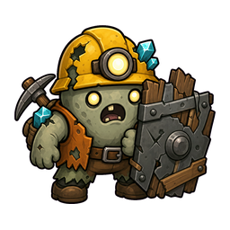
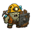
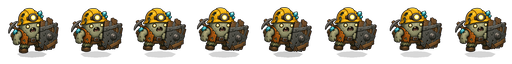

# Shield Zombie Candidate Report

## Summary

`shield_zombie`는 P7 전투 로직에 이미 등장하지만, 현재 `scripts/main.gd`에서는 전용 single-image sprite 없이 primitive fallback으로 그려진다. 이번 리포트는 자동 에셋 하네스의 첫 세로 슬라이스로, built-in image generation으로 원본 후보를 만들고, chroma-key 제거, 256셀 정규화, 64px preview, Godot runtime preview 검증까지 수행했다.

이 후보는 아직 `main` 실사용 에셋으로 승격하지 않았다. `assets/asset_manifest.json`에서는 `candidate` 상태로만 기록한다.

## Candidate Files

- Original chroma-key source: `assets/candidates/2026-06-04/shield_zombie/c01/original_chromakey.png`
- Alpha source: `assets/candidates/2026-06-04/shield_zombie/c01/alpha.png`
- Review candidate: `assets/candidates/2026-06-04/shield_zombie/c01/normalized_256.png`
- 64px preview: `assets/candidates/2026-06-04/shield_zombie/c01/preview_64.png`
- Candidate metadata: `assets/candidates/2026-06-04/shield_zombie/c01/metadata.json`
- Runtime preview metadata: `assets/candidates/2026-06-04/shield_zombie/c01/runtime_preview/metadata.json`

## Visual Review

### Normalized 256



### 64px Preview



### Runtime Move Preview

이 이미지는 실사용 스프라이트 시트가 아니라, single-image enemy가 Godot runtime bob/scale/flip 하네스에서 어떻게 보이는지 확인하는 검증용 preview sheet다.



## Generation Provenance

- Provider: built-in imagegen
- Model: built-in
- Source refs:
  - `res://assets/sprites/characters/miner_zombie_v1/zombie_idle.png`
  - `res://assets/sprites/characters/p1_monsters_runtime_v1/boss_zombie.png`
- Prompt pack: `docs/art/prompt-packs/enemy-single-image.md`
- Exact prompt used: `assets/candidates/2026-06-04/shield_zombie/c01/prompt_used.txt`
- Revised prompt: `not_available_from_builtin_tool`

## Normalization Result

From `assets/candidates/2026-06-04/shield_zombie/c01/metadata.json`:

```json
{
  "hard_gate_passed": true,
  "hard_gate_failures": [],
  "source_size": [1254, 1254],
  "alpha_bbox": [106, 138, 1137, 1054],
  "normalized_bbox": [16, 28, 240, 227],
  "opaque_pixels": 31123,
  "corner_alpha": [0, 0, 0, 0],
  "chroma_spill_pixels": 0
}
```

## Runtime Harness Result

Godot command:

```bash
/Users/highfence/Dev/Sweep/engine/godot/bin/godot.macos.editor.arm64 \
  --log-file /private/tmp/bro-exile-shield-zombie-harness-final.log \
  --path /Users/highfence/Documents/Bro-exile \
  --scene res://scenes/tools/zombie_asset_harness.tscn \
  --quit-after 360 \
  -- \
  --asset-output=/private/tmp/bro-exile-shield-zombie-harness-final \
  --asset-name=shield_zombie_c01 \
  --source-frame=res://assets/candidates/2026-06-04/shield_zombie/c01/normalized_256.png \
  --frame-count=8
```

Result:

- `ZOMBIE_ASSET_HARNESS_DONE`
- `idle_left`, `idle_right`, `move_left`, `move_right` 생성.
- 모든 variant에서:
  - `loop_matches_first_frame: true`
  - `loop_alpha_mismatch_pixels: 0`
  - `loop_mean_abs_diff_rgba: 0.0`
  - `adjacent_duplicate_pairs: 0`

## Asset Scan Context

`docs/reports/assets/2026-06-04-asset-scan.json` 기준:

- `scripts/main.gd` asset refs: 30
- unique refs: 24
- repeated icon refs:
  - `part_carbide_tip.png`: 3
  - `part_piercing_bit.png`: 2
  - `part_rapid_trigger.png`: 2
  - `part_rations.png`: 2
  - `relic_unstable_blast_crystal.png`: 2

현재 `shield_zombie`, `toxic_spider`, `bomb_miner`는 코드의 적 타입으로 존재하지만, 전용 single-image enemy sprite path는 아직 없다. 이번 후보는 그중 첫 번째 candidate다.

## Review Notes

좋은 점:

- 방패가 64px에서도 방어형 적으로 읽힌다.
- 기존 좀비 계열과 같은 광부/헬멧/광석 언어를 유지한다.
- shield/body가 플레이어보다 훨씬 회색/목재 중심이라 구분 가능하다.
- runtime bob/scale preview에서 크게 깨지지 않는다.

주의점:

- 기존 좀비 계열과 꽤 가까운 얼굴/헬멧 정체성을 유지한다. 너무 family-like하다고 느껴지면 다음 후보는 헬멧을 더 작게, 방패와 몸통 비율을 더 크게 잡는 편이 좋다.
- 실사용으로 승격하려면 `scripts/main.gd`의 `_enemy_has_sprite_asset()`와 `_draw_enemy_asset_sprite()`에 `shield_zombie` path와 transform tuning을 별도로 추가해야 한다.

## Recommended Action

이 후보는 **prototype review candidate**로는 충분하다. 바로 promotion하기보다, 사용자가 화면상 실루엣을 보고 승인하면 `assets/sprites/characters/p7_enemies_runtime_v1/shield_zombie.png` 같은 실사용 폴더로 승격하는 것이 좋다.
