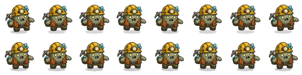
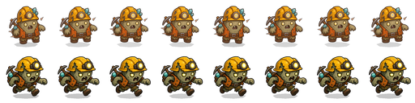
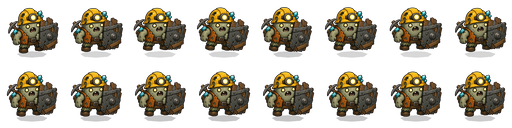
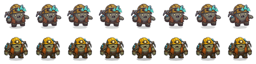
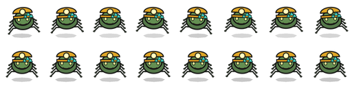
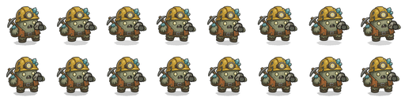
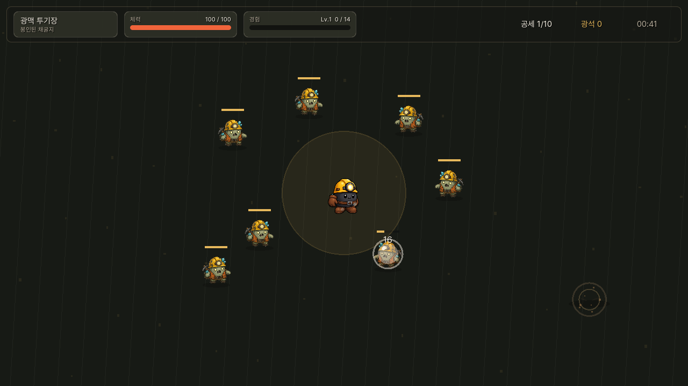
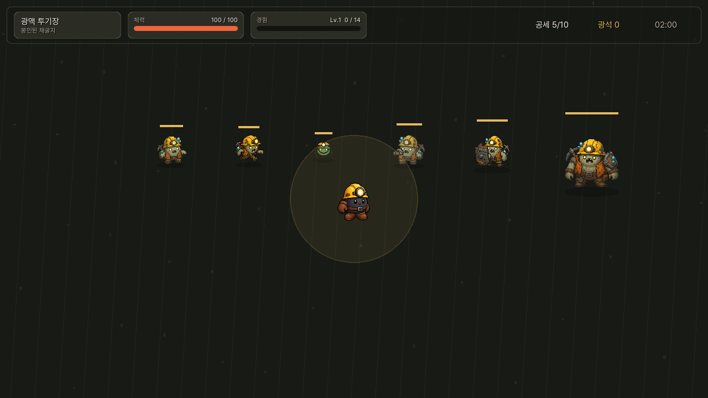

# Enemy Motion Profile Comparison Report

## Summary

single-image enemy sprite 정책은 유지하면서, 기존의 공통 `sin/cos` bob이 만드는 “달랑달랑 흔들리는 이미지” 느낌을 줄이기 위해 enemy runtime motion을 profile 기반으로 정리했다.

이번 변경은 `fast_zombie`, `boss_zombie`, `shield_zombie` 후보 이미지를 `assets/sprites/characters/p1_monsters_runtime_v2/`로 승격하고, `scripts/main.gd`의 enemy drawing을 `shamble`, `sprint`, `brace`, `heavy`, `skitter`, `throw` profile로 나눈다. 먼지/impact 이펙트는 추가하지 않았고, 접지감은 shadow scale/alpha 타이밍으로만 보강했다.

## Applied Assets

- `fast_zombie`: `assets/sprites/characters/p1_monsters_runtime_v2/fast_zombie.png`
- `shield_zombie`: `assets/sprites/characters/p1_monsters_runtime_v2/shield_zombie.png`
- `boss_zombie`: `assets/sprites/characters/p1_monsters_runtime_v2/boss_zombie.png`

기존 `assets/sprites/characters/p1_monsters_runtime_v1/` 파일은 baseline 비교용으로 유지했다.

## Motion Profiles

- `shamble`: 기본 좀비. 낮은 hop, 약한 절뚝임, 줄어든 좌우 흔들림.
- `sprint`: 빠른 좀비. 낮고 빠른 전진 lean, 작은 squash, 통통 튐 억제.
- `brace`: 방패 좀비. 거의 튀지 않고 방패를 앞세워 압박하는 전진감.
- `heavy`: 보스/엘리트. 낮은 rotation, 느린 stomp, shadow compression.
- `skitter`: 거미. 바닥 밀착형 빠른 jitter, hop 거의 없음.
- `throw`: 투척 좀비. 이동은 절제하고 약한 상체 리듬만 유지.

## Preview Comparison

비교 이미지는 **위쪽 줄이 legacy motion**, **아래쪽 줄이 새 profile motion**이다. fast/boss는 위쪽이 v1 asset + legacy motion, 아래쪽이 v2 asset + new profile이다. shield는 기존 실게임 baseline이 primitive fallback이어서, 비교 preview는 v2 shield image에 legacy motion을 적용한 줄과 `brace` profile 줄을 비교한다.

### Shamble



### Sprint



### Brace



### Heavy



### Skitter



### Throw



## Stage Captures

### Stage1



### Monster Roster



`monster_roster` 캡처는 zombie, fast, spider, thrower, shield, boss를 같은 배경에서 확인하도록 업데이트했다.

## Tuning Notes

Iteration 1:

- `fast`와 `boss`는 목표 방향에 가까웠다.
- `shamble`과 `brace`는 변화가 너무 미묘해서, 역할별 motion language가 약했다.

Iteration 2:

- `shamble`은 낮은 절뚝임이 더 보이도록 local x/y와 rotation을 소폭 키웠다.
- `brace`는 hop을 늘리지 않고 전진 press와 shadow compression을 키웠다.
- `heavy`는 더 무거운 stomp가 읽히도록 vertical settle, squash, shadow compression을 소폭 키웠다.
- `sprint`는 낮은 전진 push를 조금 더 살리고, 과한 vertical bounce는 유지하지 않았다.

Iteration 3:

- 사용하지 않았다. 2차 결과에서 fast는 통통 튐이 줄었고, boss는 달랑거림보다 무게감이 먼저 보였으며, stage capture에서 shadow/body 분리가 보이지 않았다.

## Verification Commands

Headless load:

```bash
/Users/highfence/Dev/Sweep/engine/godot/bin/godot.macos.editor.arm64 --headless --log-file /private/tmp/bro-exile-motion-profile-headless-1.log --path /Users/highfence/Documents/Bro-exile --quit
```

Profile preview harness examples:

```bash
/Users/highfence/Dev/Sweep/engine/godot/bin/godot.macos.editor.arm64 --log-file /private/tmp/bro-exile-motion-fast-sprint-iter2.log --path /Users/highfence/Documents/Bro-exile --scene res://scenes/tools/zombie_asset_harness.tscn --quit-after 360 -- --asset-output=/private/tmp/bro-exile-motion-profiles-iter2 --asset-name=fast_sprint --source-frame=res://assets/sprites/characters/p1_monsters_runtime_v2/fast_zombie.png --legacy-source-frame=res://assets/sprites/characters/p1_monsters_runtime_v1/fast_zombie.png --motion-profile=sprint --compare-legacy --frame-count=8
```

Stage captures:

```bash
/Users/highfence/Dev/Sweep/engine/godot/bin/godot.macos.editor.arm64 --log-file /private/tmp/bro-exile-motion-stage1.log --path /Users/highfence/Documents/Bro-exile -- --capture-stage1
/Users/highfence/Dev/Sweep/engine/godot/bin/godot.macos.editor.arm64 --log-file /private/tmp/bro-exile-motion-roster-2.log --path /Users/highfence/Documents/Bro-exile -- --capture-monster-roster
```

## Review Result

이 변경은 prototype review 기준으로 통과로 본다.

- fast는 legacy보다 낮게 밀고 들어오는 느낌이 강해졌다.
- boss는 새 asset과 `heavy` profile 조합으로 달랑거림보다 무게감이 먼저 보인다.
- shield는 튀지 않는 `brace` profile이 어울린다.
- spider/thrower는 기존 asset을 유지하면서도 공통 zombie bob에서 분리됐다.
- stage1/roster 캡처에서 shadow와 body가 따로 노는 문제는 보이지 않았다.
