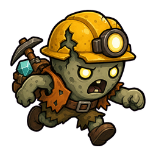
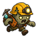
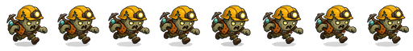
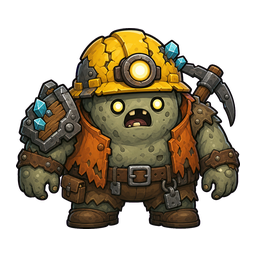
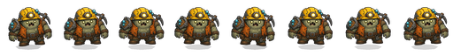

# Fast And Boss Zombie Candidate Report

## Summary

기존 `fast_zombie`와 `boss_zombie`는 기본 좀비의 정돈되지 않은 변형처럼 보인다는 피드백을 받았다. 이번 리포트는 기본 좀비와 2026-06-04 방패좀비 후보를 style anchor로 삼아, 같은 single-image enemy 하네스로 fast/boss 후보를 새로 만든 결과다.

두 후보 모두 아직 실사용 에셋으로 승격하지 않았다. `assets/asset_manifest.json`에는 기존 `current_asset`을 유지한 채 `candidate_asset`만 연결했다.

## Candidate Files

### Fast Zombie

- Review candidate: `assets/candidates/2026-06-05/fast_zombie/c01/normalized_256.png`
- 64px preview: `assets/candidates/2026-06-05/fast_zombie/c01/preview_64.png`
- Candidate metadata: `assets/candidates/2026-06-05/fast_zombie/c01/metadata.json`
- Runtime preview metadata: `assets/candidates/2026-06-05/fast_zombie/c01/runtime_preview/metadata.json`
- Exact prompt used: `assets/candidates/2026-06-05/fast_zombie/c01/prompt_used.txt`

### Boss Zombie

- Review candidate: `assets/candidates/2026-06-05/boss_zombie/c01/normalized_256.png`
- 64px preview: `assets/candidates/2026-06-05/boss_zombie/c01/preview_64.png`
- Candidate metadata: `assets/candidates/2026-06-05/boss_zombie/c01/metadata.json`
- Runtime preview metadata: `assets/candidates/2026-06-05/boss_zombie/c01/runtime_preview/metadata.json`
- Exact prompt used: `assets/candidates/2026-06-05/boss_zombie/c01/prompt_used.txt`

## Visual Review

### Fast Zombie 256



### Fast Zombie 64



### Fast Zombie Runtime Move Preview



### Boss Zombie 256



### Boss Zombie 64


### Boss Zombie Runtime Move Preview



## Generation Provenance

- Provider: built-in imagegen
- Model: built-in
- Prompt pack: `docs/art/prompt-packs/enemy-single-image.md`
- Revised prompt: `not_available_from_builtin_tool`
- Source refs:
  - `res://assets/sprites/characters/miner_zombie_v1/zombie_idle.png`
  - `res://assets/candidates/2026-06-04/shield_zombie/c01/normalized_256.png`

## Normalization Result

Fast zombie:

```json
{
  "hard_gate_passed": true,
  "hard_gate_failures": [],
  "normalized_bbox": [17, 16, 239, 240],
  "opaque_pixels": 31354,
  "corner_alpha": [0, 0, 0, 0],
  "chroma_spill_pixels": 0
}
```

Boss zombie:

```json
{
  "hard_gate_passed": true,
  "hard_gate_failures": [],
  "normalized_bbox": [16, 28, 240, 229],
  "opaque_pixels": 32617,
  "corner_alpha": [0, 0, 0, 0],
  "chroma_spill_pixels": 0
}
```

## Runtime Harness Result

Godot runtime preview harness completed for both candidates.

Fast command source frame:

```text
res://assets/candidates/2026-06-05/fast_zombie/c01/normalized_256.png
```

Boss command source frame:

```text
res://assets/candidates/2026-06-05/boss_zombie/c01/normalized_256.png
```

For both candidates, all `idle_left`, `idle_right`, `move_left`, and `move_right` variants passed:

- `loop_matches_first_frame: true`
- `loop_alpha_mismatch_pixels: 0`
- `loop_mean_abs_diff_rgba: 0.0`
- `adjacent_duplicate_pairs: 0`

## Review Notes

Fast zombie:

- 기본 좀비와 같은 가족감은 유지하면서, 자세와 체형만으로 빠른 적임이 읽힌다.
- 기존 fast처럼 장식/속도표시를 붙인 변형보다 낫다.
- 64px에서는 발 디테일이 작아지지만, 기울어진 몸과 전진 자세가 역할을 설명한다.

Boss zombie:

- 기존 boss보다 더 넓고 무거운 실루엣이 생겼다.
- 방패좀비와 비슷한 파츠 밀도지만, 방패에 가려지지 않고 보스 몸체가 중심이다.
- 실제 게임 승격 시 보스 전용 scale, bob, shadow 크기를 키우면 더 잘 살아날 가능성이 높다.

## Recommended Action

두 후보 모두 prototype review candidate로 충분하다. 사용자가 승인하면 다음 promotion 단계에서 기존 `p1_monsters_runtime_v1/fast_zombie.png`, `p1_monsters_runtime_v1/boss_zombie.png`를 직접 덮어쓰기보다, 먼저 새 버전 폴더나 백업 경로를 두고 `scripts/main.gd`의 asset path만 교체해 stage1 캡처로 비교하는 편이 좋다.
